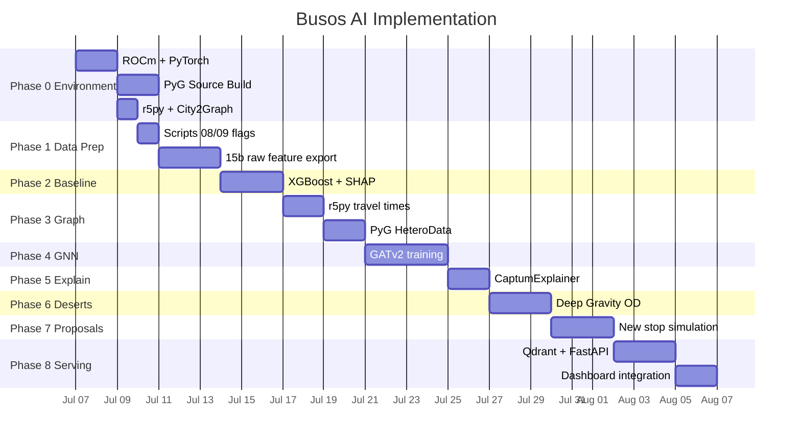

# AI_PLAN.md — Busos Spatial Intelligence Engine

> Engineering specification for implementing AI/ML in the busos urban transit analysis platform.
> Based on verified research from [AI_research_potential.md](file:///home/gzyms/Dev%20Projects/busos/AI_research_potential.md), cross-validated against current ecosystem state (July 2026).

---

## 0. Scope Definition

### MVP Target
- **City:** Kielce
- **Rationale:** 9,550 valid RCN transactions (median 7,442 PLN/m2), medium density transit network, full GTFS/OSM/GUS coverage, well-understood data quality from prior pipeline runs.

### Success Metrics

| Metric | Baseline (Phase 2) | GNN Target (Phase 4) | Meaning |
|---|---|---|---|
| MAE on `price_m2` | Establish | Beat baseline or explain why | Mean Absolute Error on held-out test set (20%) |
| R2 on `price_m2` | Establish | Beat baseline or explain why | Coefficient of determination |
| TOD Premium (PLN/m2/kurs) | Extract via SHAP | Extract via CaptumExplainer | How many PLN/m2 does +1 bus/hour add |
| Spatial Autocorrelation (Moran's I) of residuals | Measure | Must decrease | Lower = model captures spatial structure better |

### Hardware Constraints

| Component | Spec | Hard Limit |
|---|---|---|
| GPU | Radeon RX 9060 XT 16GB (RDNA 4, `gfx1200`) | 16 GB VRAM, NeighborLoader mandatory |
| RAM | 32 GB DDR5 | r5py capped at 12 GB (`r5py.set_max_memory("12G")`) |
| CPU | i5-14600KF (14C/20T) | r5py routing fully parallelized |
| Storage | NVMe 1TB PCIe Gen4 | No constraint for single-city MVP |
| OS | Ubuntu 24.04 LTS | Native ROCm (no WSL2) |

### Principles
1. **Pipeline 00-15 remains UNTOUCHED.** AI operates on outputs, not internals.
2. **City-at-a-time isolation.** No cross-city training until Phase 4 proves single-city viability.
3. **Baseline-first rigor.** GNN (Phase 4) must demonstrably outperform XGBoost (Phase 2) on the same features, or provide novel spatial insight unavailable from flat models.
4. **No data fabrication.** Broken RCN records are flagged, not silently repaired.

> [!IMPORTANT]
> **Correction vs. AI_research_potential.md:** Current academic consensus (Geerts et al., 2025) shows GNNs generally do NOT outperform tree-based models for property price prediction on tabular features. GATv2 is justified here for capturing spatial heterogeneity (barriers, non-stationarity), not raw MAE improvement. The XGBoost baseline is therefore not optional — it is the benchmark.

---

## 1. Phase 0: Environment Setup

### 1.1 ROCm + PyTorch

```bash
# 1. Verify GPU detection
rocminfo | grep gfx1200

# 2. Add user to required groups
sudo usermod -a -G render,video $LOGNAME

# 3. Install PyTorch with ROCm 7.2
pip install torch torchvision torchaudio --index-url https://download.pytorch.org/whl/rocm7.2

# 4. Validate
python -c "import torch; print(torch.cuda.is_available()); print(torch.cuda.get_device_name(0))"
```

### 1.2 PyTorch Geometric (Source Build Required)

> [!WARNING]
> **No pre-built ROCm wheels exist** for `pyg-lib`, `torch-scatter`, `torch-sparse`, `torch-cluster`. Must build from source against the ROCm PyTorch install. Budget 1-2 days. Docker fallback: `rocm/pytorch` image.

```bash
# Build PyG extensions from source
pip install torch-geometric

# For each extension (torch-scatter, torch-sparse, torch-cluster):
git clone https://github.com/pyg-team/pyg-lib.git
cd pyg-lib && pip install -e . --no-build-isolation
# Repeat for torch-scatter, torch-sparse, torch-cluster

# Validate
python -c "import torch_geometric; print(torch_geometric.__version__)"
```

**Fallback plan:** If source build fails, run GNN training on CPU (slower but functional for Kielce-scale data). GPU used only for PyTorch core ops.

### 1.3 City2Graph

```bash
# Install base (no PyTorch bundled — we already have ROCm PyTorch)
pip install city2graph

# Validate
python -c "from city2graph import Graph; print('OK')"
```

**Note:** City2Graph has no `[rocm]` extra. Base install + separately installed PyTorch ROCm is the correct approach.

### 1.4 r5py + JDK 21

```bash
# Conda recommended (auto-installs OpenJDK 21)
conda install -c conda-forge r5py

# OR pip (requires manual JDK 21 install)
sudo apt install openjdk-21-jdk
pip install r5py
```

**Memory configuration** (critical for 32GB system):
```python
import r5py
r5py.set_max_memory("12G")  # Reserve 20GB for OS + Python + GeoPandas
```

### 1.5 New Requirements File

Create `requirements-ai.txt`:
```
# Core ML
torch>=2.6
torch-geometric>=2.6
# torch-scatter, torch-sparse, torch-cluster — built from source

# Spatial Routing
r5py>=1.1

# Graph Construction
city2graph>=0.4
osmnx>=2.1

# Tabular ML (Baseline)
xgboost>=2.1
catboost>=1.2
scikit-learn>=1.5

# Interpretability
captum>=0.7

# Hex Grid
h3>=4.0

# Spatial Statistics
esda>=2.6
libpysal>=4.10

# Vector DB (Phase 8)
qdrant-client>=1.12

# Visualization
matplotlib>=3.9
seaborn>=0.13
```

### Acceptance Criteria — Phase 0
- [ ] `torch.cuda.is_available()` returns `True` on ROCm
- [ ] `torch_geometric` imports without error
- [ ] `r5py.TransportNetwork` initializes with Kielce OSM + GTFS
- [ ] `city2graph.Graph.gdf_to_pyg` produces a valid PyG `Data` object
- [ ] Total venv size < 15 GB

---

## 2. Phase 1: Data Preparation

### 2.1 Modify Scripts 08/09 — Add Repair Flags

**Goal:** Keep existing repair logic but mark every repaired record for optional exclusion by AI models.

**Changes to** [08_fix_relational_data.py](file:///home/gzyms/Dev%20Projects/busos/scripts/pipeline/08_fix_relational_data.py):
- Add column `repair_source = 'script_08_xlink_resolve'` to every recovered transaction
- Add column `repair_confidence` (`high` if all XLink refs resolved, `low` if fallback geometry used)

**Changes to** [09_fix_suwalki_geometry.py](file:///home/gzyms/Dev%20Projects/busos/scripts/pipeline/09_fix_suwalki_geometry.py):
- Add column `repair_source = 'script_09_centroid_from_parent'`
- Add column `repair_confidence` (`high` if polygon centroid, `low` if single fallback coordinate)
- Scope: Only Suwalki (hardcoded city check)

**Result:** AI models can filter on `repair_source IS NULL` for strict training, or include flagged records for larger training sets with known noise.

### 2.2 New Script: 15b_export_raw_features.py

**Location:** `scripts/pipeline/15b_export_raw_features.py`

**Purpose:** Export a clean, un-scored feature matrix from the same source data that step 15 uses, but WITHOUT:
- Tier assignment (no `poi_valuation.json`)
- Huff model gravity weighting (no `K_DECAY=0.005`, no `penalty_power`)
- Z-Score normalization (no `Z(log1p(x)) * weight`)
- AgglomerativeClustering hub merging (no 150m/100m thresholds)

**Input files (per city, from `02_spatial/`):**
- `stops.gpkg` — transit nodes
- `infrastructure.gpkg` — raw OSM objects with `all_tags` hstore
- `transactions.gpkg` — RCN records with `price_m2`
- `population_250m.gpkg` — demographic grid

**Output: `04_results/raw_features_ai.parquet`**

Schema (one row per physical stop):

| Column | Type | Source | Description |
|---|---|---|---|
| `stop_id` | str | stops.gpkg | Unique stop identifier |
| `stop_name` | str | stops.gpkg | Original name |
| `norm_name` | str | stops.gpkg | Normalized name (regex-cleaned) |
| `lat` | float | stops.gpkg | WGS84 latitude |
| `lon` | float | stops.gpkg | WGS84 longitude |
| `x_2180` | float | stops.gpkg | EPSG:2180 easting |
| `y_2180` | float | stops.gpkg | EPSG:2180 northing |
| `h3_res9` | str | computed | H3 hex index at resolution 9 |
| `transit_freq` | float | GTFS | Unique departures/hour (06:00-20:00) |
| `transit_routes_unique` | int | GTFS | Number of distinct routes serving this stop |
| `transit_span_hours` | float | GTFS | Operating window (first departure to last) |
| `pop_250m_total` | int | population_250m | Total population in cells within 500m (raw, no Huff) |
| `pop_250m_cells_count` | int | population_250m | Number of 250m grid cells within 500m |
| `rcn_median_price_m2` | float | transactions.gpkg | Median price/m2 within 500m (IQR filtered) |
| `rcn_transaction_count` | int | transactions.gpkg | Number of transactions within 500m |
| `rcn_mean_area_m2` | float | transactions.gpkg | Mean apartment area within 500m |
| `poi_count_health` | int | infrastructure.gpkg | Raw count: hospitals, clinics, pharmacies within 500m |
| `poi_count_education` | int | infrastructure.gpkg | Raw count: schools, universities, kindergartens |
| `poi_count_commerce` | int | infrastructure.gpkg | Raw count: shops, malls, supermarkets |
| `poi_count_leisure` | int | infrastructure.gpkg | Raw count: parks, sports, restaurants, cafes |
| `poi_count_government` | int | infrastructure.gpkg | Raw count: offices, courts, police |
| `poi_count_transport` | int | infrastructure.gpkg | Raw count: rail, airports, bus terminals |
| `poi_nearest_dist_health` | float | infrastructure.gpkg | Distance (m, EPSG:2180) to nearest health POI |
| `poi_nearest_dist_education` | float | infrastructure.gpkg | Distance to nearest education POI |
| `poi_nearest_dist_commerce` | float | infrastructure.gpkg | Distance to nearest commerce POI |
| `poi_nearest_dist_leisure` | float | infrastructure.gpkg | Distance to nearest leisure POI |
| `poi_nearest_dist_government` | float | infrastructure.gpkg | Distance to nearest government POI |
| `poi_nearest_dist_transport` | float | infrastructure.gpkg | Distance to nearest transport POI |
| `poi_total_count_150m` | int | infrastructure.gpkg | All POIs within 150m |
| `poi_total_count_500m` | int | infrastructure.gpkg | All POIs within 500m |
| `poi_total_count_1500m` | int | infrastructure.gpkg | All POIs within 1500m |
| `poi_category_diversity` | int | infrastructure.gpkg | Unique OSM categories within 500m (out of 34 known) |
| `repair_source` | str/null | transactions.gpkg | Flag from script 08/09 (null = clean) |
| `dist_to_cbd` | float | computed | Euclidean distance to city center (meters) |
| `nearest_road_class` | str | OSM | Highway tag of nearest road (e.g., primary, residential) |
| `bdot_building_type` | str | BDOT10k | Building function/type |
| `ceidg_business_count` | int | CEIDG | Number of active businesses in 500m |

**Additional output: `04_results/raw_poi_distances.parquet`**

Flat matrix: every stop-to-POI pair within 1500m.

| Column | Type | Description |
|---|---|---|
| `stop_id` | str | Stop identifier |
| `poi_id` | str | POI identifier (OSM) |
| `osm_category` | str | Raw OSM category (from 34 identified in step 14) |
| `domain` | str | One of 6 domains: HEALTH, EDUCATION, COMMERCE, LEISURE, GOVERNMENT, TRANSPORT |
| `distance_m` | float | Euclidean distance in meters (EPSG:2180) |
| `poi_area_m2` | float | Building footprint area (if polygon) |

### 2.3 Integration with Orchestrator

Add `15b` as optional step triggered by flag `--ai-export`:
```python
# In orchestrator.py — no modification to steps 00-15
if args.ai_export:
    run_script("15b_export_raw_features.py", city)
```

### Acceptance Criteria — Phase 1
- [ ] `raw_features_ai.parquet` for Kielce has one row per physical stop
- [ ] All 31 columns populated (except `repair_source` which is nullable)
- [ ] `rcn_median_price_m2` correlation with existing `market_val` from step 15 > 0.95
- [ ] `raw_poi_distances.parquet` contains all stop-POI pairs within 1500m
- [ ] Scripts 08/09 produce `repair_source` and `repair_confidence` columns

---

### 2.3 External Government Data Integration (GUGiK & Full RCN)
To maximize the feature space and avoid Omitted Variable Bias, the following open government APIs and datasets must be integrated:
1. **Full RCN (Rejestr Cen Nieruchomości):** Since Feb 2026, RCN is fully open and free. Instead of partial scraping, download the full national/voivodeship GeoParquet from Geoportal (`mapy.geoportal.gov.pl/wss/service/rcn`).
2. **BDOT10k (Topography & Buildings):** Download bulk GeoParquet from Geoportal (Data for download -> Topography). Provides building footprints, year of construction, number of floors, and building functions.
3. **K-GESUT (Utilities):** Powiat-level data for underground infrastructure. 
4. **ULDK (Usługa Lokalizacji Działek Katastralnych):** GUGiK API for precise parcel geometry querying via HTTP GET.
5. **EZiUDP (Ewidencja Zbiorów i Usług):** The central registry for all local county WFS addresses to fetch live spatial data if national GeoParquets are delayed.

## 3. Phase 2: XGBoost Baseline (TOD Premium)

**Location:** `scripts/ai_models/01_baseline_tod_premium.py`

### 3.1 Problem Formulation

**Task:** Supervised regression. Predict `rcn_median_price_m2` from spatial features.

**Target variable (Y):** `rcn_median_price_m2` from `raw_features_ai.parquet`

**Feature set (X):** All columns except `stop_id`, `stop_name`, `norm_name`, `lat`, `lon`, `repair_source`, and `rcn_median_price_m2` itself.

**Split:** 80/20 spatial block split (group by H3 resolution 7 hexagons to prevent spatial leakage).

### 3.2 Model Configuration

```python
import xgboost as xgb

model = xgb.XGBRegressor(
    n_estimators=500,
    max_depth=6,
    learning_rate=0.05,
    subsample=0.8,
    colsample_bytree=0.8,
    reg_alpha=1.0,
    reg_lambda=1.0,
    tree_method='hist',
    device='cpu',
    random_state=42,
    early_stopping_rounds=20,
)
```

**Also run CatBoost** as sanity check (often outperforms XGBoost on mixed feature types).

### 3.3 TOD Premium Extraction (SHAP)

```python
import shap

explainer = shap.TreeExplainer(model)
shap_values = explainer(X_test)

# Extract: "How much does +1 departure/hour contribute to price_m2?"
# WARNING: SHAP median is correlational. Use ALE (Accumulated Local Effects) 
# from scikit-learn/alibi for true marginal effect when features are correlated.
from sklearn.inspection import PartialDependenceDisplay
# tod_premium_per_kurs should be derived from ALE slope, not SHAP median.
```

**Deliverable:** JSON report per city:
```json
{
  "city": "kielce",
  "model": "xgboost_baseline",
  "mae": null,
  "r2": null,
  "moran_i_residuals": null,
  "tod_premium_plnm2_per_kurs_hour": null,
  "top_5_features_by_shap": []
}
```

### 3.4 Spatial Residual Analysis

```python
from esda.moran import Moran
import libpysal

residuals = y_test - model.predict(X_test)
w = libpysal.weights.KNN.from_dataframe(test_gdf, k=8)
mi = Moran(residuals, w)
# If mi.I > 0.15 → significant spatial structure missed → GNN justified
```

**Decision gate:** If Moran's I of residuals > 0.15, proceed to Phase 4 (GNN captures spatial structure XGBoost misses). If < 0.05, flat model already captures spatial patterns — GNN becomes exploratory.

### Acceptance Criteria — Phase 2
- [ ] XGBoost R2 > 0.5 on held-out spatial test set
- [ ] SHAP values computed for all features
- [ ] TOD Premium extracted in PLN/m2 per departure/hour
- [ ] Moran's I of residuals measured and documented
- [ ] CatBoost comparison run (sanity check)
- [ ] Results exported as JSON + SHAP summary plot (PNG)

---

## 4. Phase 3: Graph Construction

**Location:** `scripts/ai_models/02_build_city_graph.py`

### 4.1 Network Distance Computation (r5py)

Replace Euclidean distances with real walking distances via street network.

```python
import r5py
r5py.set_max_memory("12G")

network = r5py.TransportNetwork(
    osm_pbf="data/poland/poland-latest.osm.pbf",
    gtfs=["data/cities/kielce/gtfs/kielce_gtfs.zip"]
)

ttm = r5py.TravelTimeMatrix(
    transport_network=network,
    origins=stops_gdf,
    destinations=pois_gdf,
    transport_modes=[r5py.TransportMode.WALK],
    departure=datetime(2026, 7, 7, 8, 0),  # Monday 8:00
    departure_time_window=timedelta(hours=2),
    max_time=timedelta(minutes=20),
)
```

**Output: `04_results/network_distances.parquet`**

| Column | Type | Description |
|---|---|---|
| `from_id` | str | Stop ID |
| `to_id` | str | POI ID |
| `travel_time_minutes` | float | Walking time via street network |
| `euclidean_distance_m` | float | Straight-line (for comparison) |

### 4.2 Graph Construction — PyG HeteroData

Two approaches (choose based on Phase 0 City2Graph validation):

**Option A: City2Graph (preferred)**
```python
from city2graph import Graph, Morphology

hetero_data = Graph.gdf_to_pyg(
    nodes_gdf=stops_and_pois_gdf,
    edges_gdf=network_distances_gdf,
    node_features=['transit_freq', 'poi_count_commerce', ...],
    edge_features=['travel_time_minutes'],
)
```

**Option B: Manual PyG construction (fallback)**
```python
from torch_geometric.data import HeteroData

data = HeteroData()

# Node types
data['stop'].x = torch.tensor(stop_features, dtype=torch.float)  # [N_stops, F_stop]
data['poi'].x = torch.tensor(poi_features, dtype=torch.float)    # [N_pois, F_poi]

# Edge types (heterogeneous)
data['stop', 'walks_to', 'poi'].edge_index = edge_index_stop_poi  # [2, E]
data['stop', 'walks_to', 'poi'].edge_attr = edge_attr_times       # [E, 1]

# Transaction edges (stop → RCN)
data['stop', 'near_transaction', 'transaction'].edge_index = ...
data['transaction'].y = torch.tensor(prices, dtype=torch.float)    # Target
```

### 4.3 Graph Validation

```python
from torch_geometric.utils import contains_isolated_nodes

assert not contains_isolated_nodes(
    data['stop', 'walks_to', 'poi'].edge_index,
    num_nodes=data['stop'].num_nodes
)

print(f"Stops: {data['stop'].num_nodes}")
print(f"POIs: {data['poi'].num_nodes}")
print(f"Edges (walk): {data['stop', 'walks_to', 'poi'].num_edges}")
print(f"Avg edges per stop: {data['stop', 'walks_to', 'poi'].num_edges / data['stop'].num_nodes:.1f}")
```

### Acceptance Criteria — Phase 3
- [ ] r5py travel time matrix generated for Kielce (all stops x POIs within 20 min walk)
- [ ] Peak RAM during r5py < 20 GB (measured with `psutil`)
- [ ] HeteroData object created with `stop` and `poi` node types
- [ ] No isolated stop nodes in the graph
- [ ] Graph saved to `04_results/kielce_graph.pt`

---

## 5. Phase 4: GNN Training (GATv2)

**Location:** `scripts/ai_models/03_train_gnn_tod.py`

### 5.1 Model Architecture

```python
import torch
import torch.nn.functional as F
from torch_geometric.nn import GATv2Conv, to_hetero
import pytorch_lightning as pl

class TODPriceGNN(pl.LightningModule):
    def __init__(self, in_channels, hidden_channels=64, heads=4):
        super().__init__()
        self.conv1 = GATv2Conv(in_channels, hidden_channels, heads=heads,
                               edge_dim=1, add_self_loops=False)
        self.conv2 = GATv2Conv(hidden_channels * heads, hidden_channels, heads=1,
                               edge_dim=1, add_self_loops=False)
        self.linear = torch.nn.Linear(hidden_channels, 1)

    def forward(self, x, edge_index, edge_attr):
        x = F.elu(self.conv1(x, edge_index, edge_attr))
        x = F.dropout(x, p=0.3, training=self.training)
        x = F.elu(self.conv2(x, edge_index, edge_attr))
        return self.linear(x).squeeze(-1)

    def training_step(self, batch, batch_idx):
        pred = self(batch.x, batch.edge_index, batch.edge_attr)
        loss = F.mse_loss(pred[batch.train_mask], batch.y[batch.train_mask])
        self.log('train_loss', loss)
        return loss

    def configure_optimizers(self):
        return torch.optim.Adam(self.parameters(), lr=0.001, weight_decay=5e-4)
```

### 5.2 NeighborLoader (VRAM Safety)

```python
from torch_geometric.loader import NeighborLoader

train_loader = NeighborLoader(
    data,
    num_neighbors=[15, 10],      # 2-hop: 15 neighbors hop 1, 10 hop 2
    batch_size=128,
    input_nodes='stop',
    shuffle=True,
)
```

**VRAM budget:** 128 batch x 15 x 10 neighbors x 64 hidden x 4 heads ~ 500MB per batch. Well within 16GB.

### 5.3 Training Configuration

| Parameter | Value | Rationale |
|---|---|---|
| Epochs | 200 | Early stopping patience=20 |
| Learning rate | 0.001 | Adam default, decay on plateau |
| Hidden channels | 64 | Balance capacity vs VRAM |
| Attention heads | 4 (conv1), 1 (conv2) | Standard GATv2 setup |
| Dropout | 0.3 | Prevent overfitting on small city |
| Loss | MSE | Regression task |
| Spatial split | H3 res-7 block split | Prevent leakage |

### 5.4 Comparison with Baseline

| Metric | XGBoost (Phase 2) | GATv2 (Phase 4) | Delta |
|---|---|---|---|
| MAE | {from Phase 2} | {measured} | % improvement |
| R2 | {from Phase 2} | {measured} | % improvement |
| Moran's I (residuals) | {from Phase 2} | {measured} | Must decrease |
| TOD Premium | {from Phase 2} | {from Phase 5} | Spatial variation |

**Decision gate:** If GATv2 R2 < XGBoost R2 AND Moran's I does not decrease, GNN adds no value for this city. Document findings honestly — negative results are valid research.

### Acceptance Criteria — Phase 4
- [ ] Model trains without OOM on RX 9060 XT
- [ ] Training converges (loss decreasing over epochs)
- [ ] MAE/R2 compared against XGBoost baseline
- [ ] Moran's I of GNN residuals < Moran's I of XGBoost residuals
- [ ] Model checkpoint saved to `04_results/gnn_model_kielce.pt`
- [ ] Attention weights extractable per edge

---

## 6. Phase 5: Interpretability (TOD Premium from GNN)

**Location:** `scripts/ai_models/04_explain_gnn.py`

> [!WARNING]
> **Correction vs. AI_research_potential.md:** The `shap` Python library does NOT work with GNN message-passing architectures. The correct tool is `torch_geometric.explain` with `CaptumExplainer` (which provides GradientShap, Integrated Gradients) or `GNNExplainer`.

### 6.1 Explanation Setup

```python
from torch_geometric.explain import Explainer, GNNExplainer, CaptumExplainer

# Primary: GNNExplainer (edge/feature masks)
explainer = Explainer(
    model=trained_model,
    algorithm=GNNExplainer(epochs=200),
    explanation_type='model',
    model_config=dict(
        mode='regression',
        task_level='node',
        return_type='raw',
    ),
    node_mask_type='attributes',
    edge_mask_type='object',
)

# Per-node explanation:
explanation = explainer(data.x, data.edge_index, index=node_idx, edge_attr=data.edge_attr)
# explanation.node_mask → feature importance
# explanation.edge_mask → which POI connections matter most
```

### 6.2 TOD Premium Extraction from GNN

Unlike flat SHAP, GNN explanations reveal **which specific POI connections** drive price, not just aggregate features.

**Output: `04_results/tod_premium_spatial.geojson`**
```json
{
  "type": "Feature",
  "properties": {
    "stop_id": "kielce_0042",
    "stop_name": "Czarnow",
    "predicted_price_m2": 7850,
    "actual_price_m2": 7920,
    "tod_premium_transit": 420,
    "top_3_poi_connections": [
      {"poi": "Galeria Echo", "edge_importance": 0.72, "walk_minutes": 8},
      {"poi": "Szkola nr 15", "edge_importance": 0.18, "walk_minutes": 4},
      {"poi": "Przychodnia", "edge_importance": 0.06, "walk_minutes": 12}
    ]
  }
}
```

### 6.3 Comparison: XGBoost SHAP vs GNN Explanation

| Aspect | XGBoost SHAP | GNN CaptumExplainer |
|---|---|---|
| Granularity | Feature-level (global) | Edge-level (per connection) |
| Spatial context | None (flat features) | Captures barriers, walk paths |
| TOD Premium | Single number for city | Different per stop (spatial variation) |
| EU AI Act readiness | Sufficient | Stronger (graph path transparency) |


### 6.4 Causal Verification (Placebo & Barriers)

To verify the GNN isn't just hallucinating "urban density" as "transit value":
1. **Placebo Test:** Generate fake stops in random urban locations with 0 transit. Run `Explainer` on them. If they get a TOD Premium > 0, the model is measuring density, not transit.
2. **Barrier Variation:** Compare nodes with identical Euclidean distance to a stop but different Network distance (due to rivers/tracks). The price delta isolates pure accessibility.

### Acceptance Criteria — Phase 5
- [ ] GNNExplainer produces valid edge masks for sample nodes
- [ ] CaptumExplainer (Integrated Gradients) runs without errors
- [ ] TOD Premium computed per stop (not just city average)
- [ ] GeoJSON with explanations exported for dashboard integration
- [ ] Heatmap visualization of attention weights generated (PNG)

---

## 7. Phase 6: Transport Desert Detection

**Location:** `scripts/ai_models/05_detect_transport_deserts.py`

### 7.1 Origin-Destination Matrix Synthesis (Deep Gravity)

Using `scikit-mobility` to generate synthetic passenger flows from population grids to POI clusters.

```python
import skmob
from skmob.models.gravity import Gravity

gravity_model = Gravity(gravity_type='doubly constrained')
synthetic_flows = gravity_model.generate(
    spatial_tessellation=h3_tessellation,
    relevance_column='population',
    out_format='flows'
)
```

### 7.2 Desert Identification

```python
# Compare synthetic demand (from Deep Gravity) with actual supply (GTFS)
demand_supply_ratio = (
    synthetic_flows.groupby('destination')['flow'].sum()
    / actual_gtfs_freq
)

# Deserts: high demand, low supply
deserts = demand_supply_ratio[demand_supply_ratio > threshold].sort_values(ascending=False)
```

**Output: `04_results/transport_deserts.geojson`**

| Property | Type | Description |
|---|---|---|
| `h3_hex` | str | H3 index of underserved area |
| `synthetic_demand` | float | Model-estimated passenger flow |
| `actual_supply` | float | GTFS departures/hour |
| `demand_supply_ratio` | float | Higher = worse desert |
| `affected_population` | int | People in this hex |
| `nearest_stop_walk_min` | float | Walking time to closest stop |

### 7.3 Existing Stop Quality Audit

Cross-reference GNN-derived embeddings with transit frequency:
- Stops with **high spatial value** (strong GNN embedding) but **low frequency** = underserved
- Stops with **low spatial value** but **high frequency** = overserved (resource waste)

### Acceptance Criteria — Phase 6
- [ ] Deep Gravity model calibrated on Kielce
- [ ] Synthetic OD matrix generated
- [ ] At least 3 transport deserts identified with demand > 2x supply
- [ ] Existing stop quality audit completed (overserved/underserved ranking)
- [ ] Results exportable to dashboard GeoJSON

---

## 8. Phase 7: New Stop Proposals

**Location:** `scripts/ai_models/06_propose_new_stops.py`

### 8.1 Candidate Generation

From Phase 6 desert areas:
1. Centroid of each desert H3 hexagon
2. Snap to nearest road segment (from OSMnx street graph)
3. Filter: minimum 200m from existing stop (no cannibalization)

### 8.2 Impact Simulation

For each candidate:
1. Insert new node into the GNN graph
2. Compute network distances to surrounding POIs (r5py)
3. Re-run GNN inference (forward pass only, no training)
4. Measure predicted change in surrounding `price_m2`
5. Measure reduction in desert severity (demand/supply ratio)

### 8.3 Ranking

```python
# Score = population_served * predicted_price_uplift * accessibility_improvement
proposals = proposals.sort_values('composite_score', ascending=False)
```

**Output: `04_results/proposed_stops.geojson`**

| Property | Type | Description |
|---|---|---|
| `candidate_id` | str | Unique proposal ID |
| `lat`, `lon` | float | Snapped coordinates |
| `population_served` | int | People within 500m |
| `predicted_tod_premium` | float | Estimated PLN/m2 uplift |
| `desert_reduction_pct` | float | % decrease in demand/supply ratio |
| `composite_score` | float | Weighted ranking score |
| `nearest_existing_stop` | str | Name + distance |

### Acceptance Criteria — Phase 7
- [ ] At least 5 candidate stops generated for Kielce
- [ ] Each candidate has predicted impact metrics
- [ ] No candidate within 200m of existing stop
- [ ] Composite ranking produced
- [ ] GeoJSON exportable to dashboard

---

## 9. Phase 8: Serving Layer

### 9.1 Qdrant (Vector Search)

Store GNN node embeddings for similarity search ("Find areas like mine").

```python
from qdrant_client import QdrantClient
from qdrant_client.http import models

client = QdrantClient(host="localhost", port=6333)

client.create_collection(
    collection_name="stop_embeddings",
    vectors_config=models.VectorParams(size=64, distance=models.Distance.COSINE),
)

client.upsert(
    collection_name="stop_embeddings",
    points=[
        models.PointStruct(
            id=i,
            vector=embedding.tolist(),
            payload={
                "city": "kielce",
                "stop_name": name,
                "location": {"lat": lat, "lon": lon}
            },
        )
        for i, (embedding, name, lat, lon) in enumerate(stops_data)
    ],
)
```

**Geo-polygon search** (confirmed production-ready):
```python
results = client.search(
    collection_name="stop_embeddings",
    query_vector=query_embedding,
    query_filter=models.Filter(
        must=[
            models.FieldCondition(
                key="location",
                geo_polygon=models.GeoPolygon(
                    exterior=models.GeoLineString(
                        points=[models.GeoPoint(lat=..., lon=...), ...]
                    )
                )
            )
        ]
    ),
    limit=10,
)
```

### 9.2 FastAPI Backend

```
GET /api/v1/stops/{city}                    → All stops with scores
GET /api/v1/stop/{stop_id}/explanation      → GNN explanation for single stop
GET /api/v1/deserts/{city}                  → Transport desert GeoJSON
GET /api/v1/proposals/{city}                → New stop proposals GeoJSON
GET /api/v1/similar?lat=...&lon=...&k=10    → Qdrant similarity search
GET /api/v1/tod-premium/{city}              → TOD Premium report
```

### 9.3 Dashboard Integration

Feed GeoJSON outputs directly to existing [urban-dashboard](file:///home/gzyms/Dev%20Projects/busos/urban-dashboard) (Next.js).

New map layers:
1. **TOD Premium heatmap** — color-coded PLN/m2 per stop
2. **Transport Deserts** — red hexagons with demand/supply ratio
3. **New Stop Proposals** — markers with impact metrics
4. **Similarity search** — "Find areas like this" interaction
5. **GNN Attention overlay** — which POI connections drive value

---

## 10. Timeline and Dependencies



**Estimated total: ~30 working days (6 weeks)**

---

## 11. Portfolio Amplifiers

> [!TIP]
> These additions maximize impact for junior AI developer portfolio applications.

### 11.1 Additional Models to Consider

| Model | Difficulty | Portfolio Impact | Description |
|---|---|---|---|
| **Spatial Autoregressive Model (SAR)** | Low | Medium | Classical econometric baseline — proves spatial statistics literacy |
| **Geographically Weighted Regression (GWR)** | Low | Medium | Shows non-stationarity awareness |
| **GraphSAGE** | Medium | High | Alternative GNN — comparing architectures shows rigor |
| **Variational Graph Autoencoder (VGAE)** | Medium | Very High | Unsupervised embedding learning — generative modeling |
| **Ensemble (XGBoost + GNN residuals)** | Medium | High | Hybrid approach — best of both worlds, shows practical maturity |

### 11.2 Publishable Artifacts

1. **Technical blog post** — "How GNN Attention Reveals Transit Value in Polish Cities"
2. **Interactive demo** — Streamlit app with map + SHAP waterfall + GNN attention overlay
3. **Benchmark table** — XGBoost vs CatBoost vs GATv2 vs GraphSAGE on same data
4. **Open dataset** — Anonymized `raw_features_ai.parquet` for community benchmarking
5. **Negative results paper** — If GNN does NOT beat XGBoost, document WHY (equally valuable)

### 11.3 Unique Selling Points vs Competition

| What you have | Why it matters |
|---|---|
| Real government data (RCN, GTFS, GUS) | Not toy datasets — actual policy-grade information |
| 57 cities, 220k+ transactions | Scale that junior portfolios almost never have |
| End-to-end pipeline (ETL -> ML -> Serving -> Dashboard) | Full stack, not just a notebook |
| Spatial ML + GNN + Interpretability | Triple expertise signal |
| Policy-actionable output (PLN/m2 per bus/hour) | Business impact, not abstract metrics |
| Hardware-constrained engineering (32GB RAM, ROCm AMD) | Shows real-world optimization skills |

---

## 12. Risk Registry

| Risk | Probability | Impact | Mitigation |
|---|---|---|---|
| PyG ROCm source build fails | Medium | High | Docker fallback (`rocm/pytorch`), or CPU-only GNN |
| r5py exhausts 32GB RAM on Kielce | Low | High | `set_max_memory("12G")`, chunk POIs by district |
| GATv2 does not beat XGBoost | Medium | Medium | Expected per literature — value is in spatial explanation, not MAE |
| City2Graph API breaks with Polish data | Low | Medium | Manual PyG HeteroData construction (Option B) |
| Insufficient RCN transactions per stop | Low | Low | Expand catchment to 750m, accept lower resolution |
| Overfitting on single city | Medium | Medium | Cross-validate with 2nd city before generalization claims |
| `scikit-mobility` memory issues | Low | Medium | Chunk H3 tessellation, limit flow generation radius |

---

## Appendix A: Corrections to AI_research_potential.md

| Claim in original doc | Verified status | Correction |
|---|---|---|
| "ROCm 7.2 for RX 9060 XT" | Partially correct | GPU arch target is `gfx1200`, not `gfx1201` |
| "PyG natywnie wspiera ROCm" | **Incorrect** | No pre-built wheels. Source build required for extensions |
| "SHAP do analizy GNN" | **Incorrect** | `shap` library does not support GNN. Use `torch_geometric.explain` + `CaptumExplainer` |
| "GATv2 przewyzszy klasyczne modele" | **Unsupported** | Geerts et al. (2025): GNNs generally do NOT outperform tree-based for price prediction |
| "Neo4j nie warto" | Correct | PyG HeteroData + Parquet faster for single-node training |
| "City2Graph kwiecien 2026" | **Confirmed** | Available on PyPI (v0.4.0), HeteroData support confirmed |
| "r5py wymaga JDK" | Correct, version wrong | Requires JDK **21+** (not 11 or 17) |
| "Qdrant geo-filtrowanie" | **Confirmed** | Production-ready, supports geo-polygon filtering |
| "XGBoost: nie warto" | **Incorrect** | Must be Phase 2 baseline — academic rigor demands it |
| "Temporal GNN" | Correctly rejected | 32GB RAM insufficient, static graphs are correct |

---

## Appendix B: File System Layout After Full Implementation

```
scripts/
  pipeline/
    00-15 (UNTOUCHED)
    15b_export_raw_features.py          ← Phase 1
  ai_models/
    01_baseline_tod_premium.py          ← Phase 2
    02_build_city_graph.py              ← Phase 3
    03_train_gnn_tod.py                 ← Phase 4
    04_explain_gnn.py                   ← Phase 5
    05_detect_transport_deserts.py      ← Phase 6
    06_propose_new_stops.py             ← Phase 7
    07_serve_api.py                     ← Phase 8

data/cities/kielce/
  04_results/
    stop_dna.gpkg                       (existing, from step 15)
    poi_matrix.parquet                  (existing, from step 15)
    pop_matrix.parquet                  (existing, from step 15)
    raw_features_ai.parquet             ← Phase 1
    raw_poi_distances.parquet           ← Phase 1
    network_distances.parquet           ← Phase 3
    kielce_graph.pt                     ← Phase 3
    gnn_model_kielce.pt                 ← Phase 4
    tod_premium_spatial.geojson         ← Phase 5
    transport_deserts.geojson           ← Phase 6
    proposed_stops.geojson              ← Phase 7

requirements-ai.txt                     ← Phase 0
```

---

## Appendix C: Causal Inference Protocol (The "No Hallucination" Guarantee)

To ensure the models measure the **causal effect** of transit rather than spurious urban correlations (Omitted Variable Bias), the following protocol applies:

1. **Difference-in-Differences (DiD):** Use historical RCN data (2020-2026) and historical GTFS to compare price trajectories *before* and *after* a new transit line opens (e.g., Warsaw M2 subway in 2022) against a control area. This is the only way to prove true "effect".
2. **Double Machine Learning (DML):** Use `DoubleML` or `econml` packages to partial out observed confounders (distance to center, building type, road class) from both prices and transit frequency, estimating the true causal parameter on the residuals.
3. **Triangulation via CEIDG:** Validate economic value by calculating business registration dynamics (CEIDG) per H3 hex. If transit adds value, it should be visible in both real estate prices and entrepreneurial activity.
