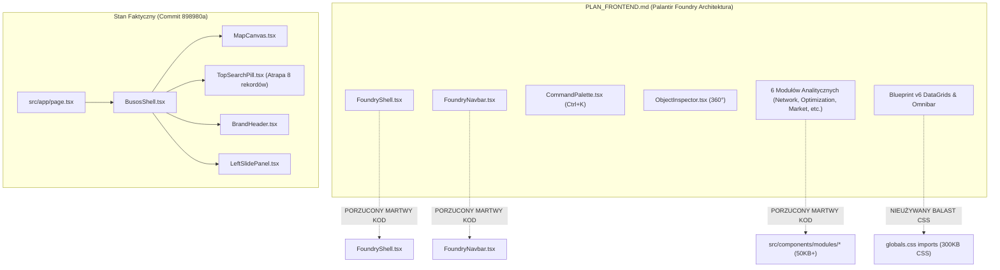
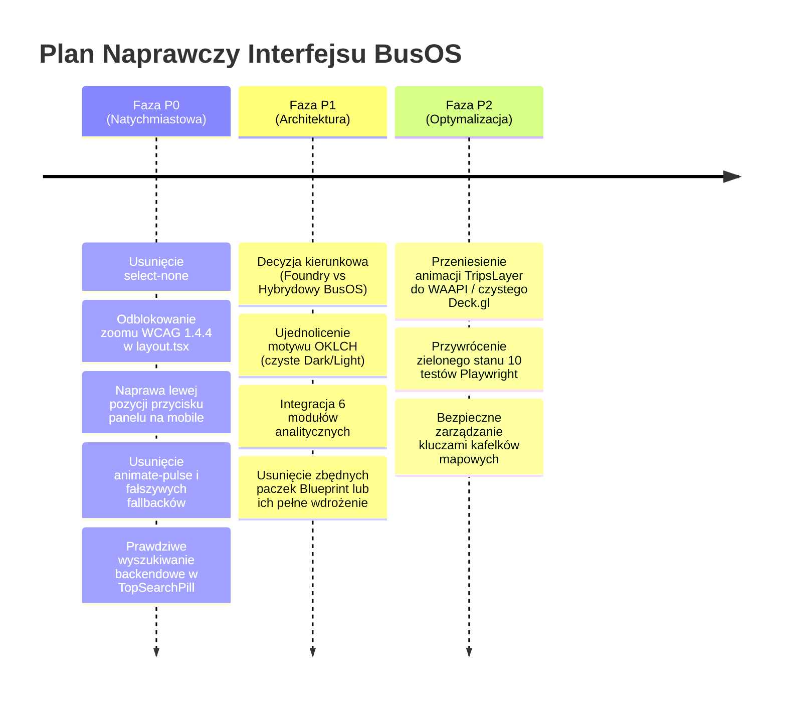

# Wielowymiarowy Raport Krytyczny: Design, Architektura & Jakość Wykonania BusOS

> **Dokument:** `RAPORT_KRYTYCZNY_BUSOS.md`  
> **Status:** `OFICJALNY AUDYT FORENSYCZNY`  
> **Data audytu:** 13 września 2026 r.  
> **Przedmiot audytu:** Warstwa frontendowa aplikacji `urban-dashboard` po wdrożeniu commita `898980a`  
> **Zastosowane standardy audytowe:** `skill-creative-design`, `skill-frontend-architect`, `skill-mobile-web`, `skill-design-engineering`, `skill-web-performance`, `skill-code-review`, WCAG 2.1/2.2 AA.

---

## 1. Executive Summary & Tablica Dojrzałości Systemu

Przeprowadzony audyt forensyczny frontendu BusOS ujawnił **drastyczną regresję architektoniczną i jakościową**, będącą bezpośrednią konsekwencją pospiesznego wdrożenia commita `898980a`. Wprowadzenie fasadowego komponentu `BusosShell.tsx` w miejsce pełnowartościowego kokpitu analitycznego `FoundryShell.tsx` nie tylko zniszczyło spójność z bazowym dokumentem architektonicznym (`PLAN_FRONTEND.md`), ale doprowadziło do **złamania elementarnych zasad dostępności cyfrowej (WCAG 2.1/2.2 AA), ergonomii urządzeń mobilnych oraz standardów inżynierii oprogramowania**.

Aplikacja w obecnym stanie posiada szereg krytycznych wad dyskwalifikujących ją jako produkt produkcyjny: od zablokowania zaznaczania tekstu na całym ekranie (`select-none`), przez znikający poza ekranem przycisk bocznego panelu na urządzeniach mobilnych, po fałszywą wyszukiwarkę, która przeszukuje zaledwie 8 rekordów w skali całego miasta.

### Tablica Oceny Wymiarów (Skala 1–10)

| Wymiar Audytu | Ocena | Status Ryzyka | Główne Zidentyfikowane Naruszenie |
| :--- | :---: | :---: | :--- |
| **1. Art Direction & Visual Philosophy** | **2 / 10** | `KRYTYCZNY` | Schizofrenia motywu (ciemne tło layoutu vs białe karty), zakazany efekt `animate-pulse` (tani szablon AI), losowe szarości zamiast spójnej palety OKLCH. |
| **2. Architektura Frontendu & SSOT** | **1 / 10** | `KATASTROFALNY` | Złamanie SSOT; odcięcie 6 pełnych modułów analitycznych (martwy kod ~50KB+), bezsensowne ładowanie 4 ciężkich arkuszy Blueprint.js w CSS. |
| **3. Mobile Web & Dostępność WCAG** | **1 / 10** | `KATASTROFALNY` | Pogwałcenie WCAG 1.4.4 (`userScalable: false`), znikający przycisk na `left: 432px` na smartfonach, podwymiarowe pola dotykowe (<44px). |
| **4. Interaction Craftsmanship & UX** | **2 / 10** | `KRYTYCZNY` | Globalna blokada kopiowania tekstu (`select-none`), atrapa wyszukiwarki sprawdzająca tylko 8 przystanków, zepsuta paginacja z filtrem po stronie klienta. |
| **5. Web Performance & Higiena API** | **3 / 10** | `WYSOKI` | Pętla 60 FPS re-renderująca komponent 755 linii w React 19, publicznie wyeksponowany placeholder klucza API MapTiler, wyścigi zapytań sieciowych. |
| **6. QA, Testy E2E & Rzetelność Danych** | **1 / 10** | `KATASTROFALNY` | Wszystkie 10 scenariuszy Playwright zostało złamanych; twardo zakodowane fałszywe dane demograficzne maskujące brak odpowiedzi z backendu. |

---

## 2. Wymiar 1: Art Direction, Visual Philosophy & Typografia

### 2.1 Schizofrenia Motywu (Theme Clashing)
W kodzie występuje fundamentalna sprzeczność pomiędzy poziomem dokumentu HTML a komponentami aplikacyjnymi:

*   **Poziom Root (`urban-dashboard/src/app/layout.tsx`, linie 42–43):**
    ```tsx
    <html lang="pl" className={`bp6-dark h-dvh ${geistSans.variable} ${geistMono.variable}`} suppressHydrationWarning>
      <body className="bp6-dark h-dvh w-full overflow-hidden bg-[oklch(0.10_0.005_260)] text-[#f8fafc] antialiased" suppressHydrationWarning>
        {children}
      </body>
    </html>
    ```
    Dokument narzuca głęboki, polarny tryb ciemny w przestrzeni OKLCH (`oklch(0.10 0.005 260)`) oraz klasy `bp6-dark`.
*   **Poziom CSS (`urban-dashboard/src/app/globals.css`, linie 8–39):**
    ```css
    :root {
      --surface-canvas: #f8fafc;
      --surface-card: #ffffff;
      --text-main: #0f172a;
      ...
      --background: var(--surface-canvas);
      --foreground: var(--text-main);
    }
    ```
    Wszystkie zmienne globalne zdefiniowano dla skrajnie jasnego interfejsu (białe karty, jasnoszare tło).
*   **Poziom Powłoki (`urban-dashboard/src/components/shell/BusosShell.tsx`, linia 65):**
    ```tsx
    <div className="relative w-full h-dvh min-h-dvh overflow-hidden bg-slate-50 font-sans select-none">
    ```
    Wymusza tło `bg-slate-50`, tworząc hybrydę: podkład mapowy ciemnieje w trybie nocnym, a pływające panele i nagłówek świecą jaskrawą bielą `#ffffff` z cieniami dla trybu jasnego.

### 2.2 Grzechy "Estetyki AI" i Taniego Szablonu
Zgodnie ze standardem `skill-creative-design` (Rozdział 5: *Eradicating the AI Aesthetic*), obowiązuje **bezwzględny zakaz** stosowania generycznych klisz generowanych przez modele LLM:

1.  **Naruszenie Reguły Pulsowania (`AgglomerationOverviewPanel.tsx`, linie 88–89):**
    ```tsx
    <span className="px-2.5 py-1 text-xs font-bold rounded-full bg-emerald-50 text-emerald-700 border border-emerald-200 flex items-center gap-1.5">
      <span className="w-1.5 h-1.5 rounded-full bg-emerald-500 animate-pulse" />
      Aktywna
    </span>
    ```
    *Wada:* Zastosowanie pulsującej zielonej kropki (`animate-pulse`). Jest to sztuczny, bezwartościowy szum statusowy, który w profesjonalnych narzędziach telemetrycznych jest niedopuszczalny.
2.  **Generyczne Zaokrąglenia i Tanie Gradienty:**
    *   Klasa `.busos-pill` w `globals.css`:
        ```css
        background: linear-gradient(135deg, #ffffff 0%, #f5f2fa 100%);
        border: 2px solid var(--brand-purple);
        box-shadow: 0 8px 30px rgba(71, 49, 127, 0.18), 0 2px 8px rgba(0, 0, 0, 0.08);
        ```
        Zastosowano mdły gradient z fioletową poświatą i agresywną ramką 2px, przypominający amatorskie szablony landing page'y z lat 2021–2023.
    *   Nadużywanie `rounded-2xl` na wielkich panelach analitycznych (`LeftSlidePanel.tsx`, `TopSearchPill.tsx`), co odbiera interfejsowi techniczny, precyzyjny charakter i marnuje cenną przestrzeń roboczą w rogach kontenerów.

### 2.3 Typografia i Rytm Przestrzenny
*   **Złamanie Reguły Bringhursta (Measure):** W panelu `AgglomerationOverviewPanel.tsx` oraz `StopDetailPanel.tsx` bloki tekstowe nie posiadają ograniczenia szerokości (`max-w-prose` lub 45–75 znaków), co przy rozszerzaniu widoku degraduje czytelność.
*   **Brak Skalowania Płynnego (Fluid Typography):** Brak implementacji funkcji `clamp()` dla nagłówków. Rozmiary skaczą skokowo z `text-xs` do `text-xl` bez matematycznej harmonii modularnej.
*   **Niekonsekwencja Cyfr Tabelarycznych:** Kluczowe wskaźniki (odjazdy/h, odległości LRS) w części kart są renderowane zwykłym fontem proporcjonalnym zamiast fontem o stałej szerokości cyfr (`tabular-nums` / `font-mono`), co wywołuje drżenie układu przy aktualizacji danych.

---

## 3. Wymiar 2: Architektura Frontendu & Złamanie SSOT



### 3.1 Złamanie Zasady Jednego Źródła Prawdy (Single Source of Truth)
Plik `PLAN_FRONTEND.md` w katalogu głównym definiuje architekturę klasy enterprise (*Palantir Foundry Workspace*), opartą na 45 trasach backendowych i 6 wyspecjalizowanych silnikach:
1.  **Command Center** (Karta Audytowa, Kafelki KPI, Magnesy POI).
2.  **Network Explorer** (Wirtualizowany DataGrid Table2 dla 60k słupków i 28k hubów).
3.  **Optimization** (The Axe List TCRP 100 + kalkulator PLN, Pustynie transportowe).
4.  **Route Analyzer** (Katalog linii GTFS, stepper sekwencji przystanków z LRS, prędkości).
5.  **Market Intel** (Wycena RCN, trendy kwartalne 2020–2026, mostek DuckDB).
6.  **Benchmarking Krajowy** (Ogólnopolski Leaderboard 30 miast).

Wprowadzony w commicie `898980a` komponent `BusosShell.tsx` **całkowicie zignorował i odciął te 6 modułów**, zastępując je prostym panelem bocznym z powierzchowną listą przystanków i ubogim podglądem miasta.

### 3.2 Drastyczny Balast Paczek i Martwy Kod (Dead Code Bloat)
*   W `urban-dashboard/src/app/globals.css` (linie 2–5) bezwzględnie importowane są 4 gigantyczne pakiety stylów Blueprint.js:
    ```css
    @import "@blueprintjs/core/lib/css/blueprint.css";
    @import "@blueprintjs/icons/lib/css/blueprint-icons.css";
    @import "@blueprintjs/table/lib/css/table.css";
    @import "@blueprintjs/select/lib/css/blueprint-select.css";
    ```
    Pliki te ważą łącznie kilkaset kilobajtów skompilowanego CSS. Tymczasem `BusosShell.tsx` oraz nowe panele w `src/components/shell/` i `src/components/panels/` **nie wykorzystują ani jednego komponentu Blueprint.js**, budując wszystko na standardowych znacznikach HTML i Tailwind CSS!
*   Katalog `src/components/modules/` (6 podkatalogów, tysiące linii zaawansowanego kodu analitycznego) stał się martwym balastem.

### 3.3 Rozbicie Spójności Magazynu Stanu (Zustand Store Desynchronization)
Magazyn `useFoundryStore` w `src/lib/store/index.ts` zarządza takimi polami jak `activeModule`, `activeSubtab`, `analyticalMode`, `selectedAxePair`, `h3Metric`. W `BusosShell.tsx` stan ten jest modyfikowany przez URL, lecz w warstwie wizualnej żaden z tych modułów nie jest renderowany. Użytkownik wpisujący w URL `?module=optimization` otrzymuje ten sam uproszczony widok mapy.

---

## 4. Wymiar 3: Mobile Web, Ergonomia Dotykowa & WCAG 2.1/2.2 AA

Wymiar ten wykazuje najbardziej alarmujące uchybienia, stanowiące bezpośrednie pogwałcenie międzynarodowych standardów prawnych i technicznych.

### 4.1 Jawne Pogwałcenie Dostępności: Zablokowanie Zoomu (WCAG 1.4.4)
W pliku `urban-dashboard/src/app/layout.tsx` (linie 27–34) wprowadzono konfigurację viewportu:
```tsx
export const viewport: Viewport = {
  width: "device-width",
  initialScale: 1,
  maximumScale: 1,
  userScalable: false, // <-- KRYTYCZNE POGWAŁCENIE WCAG 1.4.4
  viewportFit: "cover",
  themeColor: "#090a0f",
};
```
> [!CAUTION]
> **Naruszenie Kryterium Sukcesu WCAG 1.4.4 (Resize Text - Poziom AA):**  
> Wyłączenie skalowania (`userScalable: false`) oraz ograniczenie `maximumScale: 1` odbiera użytkownikom niedowidzącym możliwość powiększenia interfejsu za pomocą gestu pinch-to-zoom. Jest to kardynalny błąd accessibility, uniemożliwiający pozytywne przejście audytu dostępności publicznej.

### 4.2 Katastrofa Geometrii Mobilnej: Przycisk Znikający poza Ekranem
W pliku `urban-dashboard/src/components/shell/LeftSlidePanel.tsx` (linie 75–83) zaimplementowano boczny przycisk zwijania panelu:
```tsx
<button
  type="button"
  onClick={onToggle}
  style={{ left: isOpen ? 432 : 12 }} // <-- BŁĄD ARCHITEKTURY GEOMETRII
  className="absolute top-1/2 -translate-y-1/2 z-30 w-7 h-14 bg-white hover:bg-slate-50 border border-slate-200 shadow-lg rounded-r-xl flex items-center justify-center text-slate-500 hover:text-[#47317f] transition-all cursor-pointer"
  title={isOpen ? "Zwiń panel" : "Rozwiń panel"}
>
```
*   **Analiza Błędu:**
    Gdy panel jest otwarty (`isOpen === true`), przycisk ma na sztywno przypisaną pozycję `left: 432px`.
    Tymczasem typowe ekrany smartfonów mają szerokość:
    - iPhone SE: **375px**
    - iPhone 13/14/15/16: **390px**
    - Samsung Galaxy S23/S24: **412px**
*   **Skutek:** Na każdym współczesnym smartfonie przycisk zamykania panelu ląduje **całkowicie poza widocznym obszarem ekranu** (na 432. pikselu). Panelu po otwarciu na telefonie **nie da się zamknąć**, a sama kontrolka blokuje przewijanie horyzontalne.

### 4.3 Podwymiarowe Pola Dotykowe (Touch Targets < 44px)
Zgodnie z wytycznymi **Apple Human Interface Guidelines** oraz **WCAG 2.5.5 / 2.5.8 (Target Size)**, każdy interaktywny element dotykowy musi posiadać fizyczny obszar klikalny o wymiarach minimum **44x44px** (lub 48x48px wg Material Design).

W nowym interfejsie BusOS zasada ta została zignorowana w dziesiątkach miejsc:
1.  `BrandHeader.tsx` (L39–43): Przycisk wyboru miasta posiada padding `px-2.5 py-1`, co daje fizyczną wysokość zaledwie ~26px.
2.  `TopSearchPill.tsx` (L89–98): Przycisk czyszczenia wyszukiwania `X` posiada klasę `p-0.5 ml-2` i ikonę `w-3.5 h-3.5` — efektywny obszar dotyku to zaledwie ~18x18px. Użytkownik na telefonie regularnie chybia, klikając w pole tekstowe zamiast czyścić frazę.
3.  `FloatingMapControls.tsx` (L74–89): Przyciski warstw na widoku mobilnym mają `p-2` z ikoną 16px, co daje obszar ~32x32px.

### 4.4 Kolizja Kontrolek w Górnym Pasku (Absolute Flex Overflow)
W `BusosShell.tsx` (linie 71–90) górny pasek kontrolek umieszczono w sztywnym kontenerze:
```tsx
<div className="absolute top-4 left-4 right-4 z-20 flex items-center justify-between pointer-events-none gap-3">
```
Na ekranie telefonu o szerokości 375px:
*   BrandHeader zajmuje ~160px.
*   FloatingMapControls zajmuje ~110px.
*   Pozostała przestrzeń na wyszukiwarkę to zaledwie ~80px. Wyszukiwarka gwałtownie się kurczy lub wymusza zawijanie flexa, nakładając się na podkład mapowy i uniemożliwiając wygodną interakcję.

---

## 5. Wymiar 4: Interaction Craftsmanship & Użyteczność (UX)

### 5.1 Antywzorzec Stulecia: `select-none` na Całym Ekranie
W pliku `urban-dashboard/src/components/shell/BusosShell.tsx` (linia 65):
```tsx
<div className="relative w-full h-dvh min-h-dvh overflow-hidden bg-slate-50 font-sans select-none">
```
> [!WARNING]
> Klasa `select-none` została nałożona na **główny element-kontener całego dashboardu**. W rezultacie:
> - Użytkownik **nie może zaznaczyć ani skopiować żadnego tekstu**: ani nazwy przystanku, ani identyfikatora słupka, ani współrzędnych geograficznych, ani numeru linii autobusowej, ani kwoty transakcji mieszkaniowej czy statystyki odjazdów.
> - Dla aplikacji klasy Business Intelligence / Civic GIS jest to błąd dyskwalifikujący. Narzędzie analityczne, z którego analityk nie może skopiować danych do arkusza lub raportu, traci rację bytu.

### 5.2 Atrapa Wyszukiwarki w `TopSearchPill.tsx`
Mechanizm wyszukiwania przystanków w `urban-dashboard/src/components/shell/TopSearchPill.tsx` (linie 21–39) został zaimplementowany w sposób wadliwy poznawczo i algorytmicznie:
```tsx
fetchStopsRanking({
  city: selectedCity,
  limit: 8, // <-- POBIERA TYLKO 8 PIERWSZYCH PRZYSTANKÓW Z RANKINGU!
})
  .then((res) => {
    const q = query.toLowerCase();
    const matches = (res.items || []).filter(
      (s) =>
        s.stop_name?.toLowerCase().includes(q) ||
        s.stop_routes?.toLowerCase().includes(q) ||
        s.stop_id?.toLowerCase().includes(q)
    );
    setResults(matches);
    setLoading(false);
  })
```
*   **Mechanizm Awarii:**
    Zapytanie do backendu pobiera dokładnie **8 najpopularniejszych przystanków w całym mieście** (np. Dworzec Główny, Żytnia, Okrzei w Kielcach). Następnie kod w JavaScript sprawdza, czy wpisana przez użytkownika fraza znajduje się w **tej ósemce**.
*   **Konsekwencja:**
    W mieście posiadającym 1000 przystanków, wyszukanie dowolnego z pozostałych **992 przystanków** ZAWSZE zwróci komunikat:
    *„Nie znaleziono przystanków dla 'X'”*.
    Jest to atrapa wyszukiwarki, dająca złudzenie działania jedynie dla 3-4 najbardziej obleganych węzłów w centrum.

### 5.3 Zepsuta Paginacja w `StopCatalogPanel.tsx`
W `urban-dashboard/src/components/panels/StopCatalogPanel.tsx` (linie 34–62):
Backend odpytywany jest z parametrami `limit: 100` oraz `offset: page * 20`.
Gdy użytkownik wpisze frazę w pole wyszukiwania, kod filtruje **wyłącznie pobraną wcześniej paczkę 100 rekordów**, podczas gdy łączna liczba stron (`total`) pobierana jest z globalnego licznika bazy danych.
Prowadzi to do sytuacji, w której paginator wskazuje np. 40 dostępnych stron wyników, ale przejście na stronę 2 wyświetla pustą listę.

### 5.4 Brak Dostępności Klawiaturowej i Semantyki ARIA
*   W `BrandHeader.tsx` oraz `FloatingMapControls.tsx` menu rozwijane zrealizowano jako zwykłe znaczniki `<div>` z `onClick`.
*   Brak atrybutów `aria-haspopup="true"`, `aria-expanded={isOpen}`, `aria-controls`.
*   Brak możliwości nawigacji po pozycjach menu za pomocą strzałek klawiatury (`ArrowDown` / `ArrowUp`) oraz brak obsługi zamykania klawiszem `Escape`.
*   W `TopSearchPill.tsx` lista podpowiedzi nie posiada roli `role="listbox"`, a elementy nie posiadają `role="option"`.

---

## 6. Wymiar 5: Web Performance, Stabilność & Higiena API

### 6.1 Pętla Przerenderowań 60 FPS w `MapCanvas.tsx`
W pliku `urban-dashboard/src/components/foundry/MapCanvas.tsx` (linie 103–114):
```tsx
// 60 FPS animation timer for synthetic bus TripsLayer
const [animTime, setAnimTime] = useState(0);
useEffect(() => {
  if (!activeRouteUid || !routeGeo?.features?.length) return;
  let frameId: number;
  const loop = () => {
    setAnimTime((prev) => (prev + 2.5) % 1000); // <-- POWODUJE RE-RENDER CO 16ms
    frameId = requestAnimationFrame(loop);
  };
  frameId = requestAnimationFrame(loop);
  return () => cancelAnimationFrame(frameId);
}, [activeRouteUid, routeGeo]);
```
*   **Analiza Wydajnościowa:**
    Komponent `MapCanvas.tsx` liczy **755 linii kodu**, zarządza 5 warstwami Deck.gl, stanem widoku mapy MapLibre oraz dziesiątkami hooków `useMemo`.
    Wywołanie `setAnimTime` wewnątrz `requestAnimationFrame` zmusza silnik React 19 do pełnego re-renderowania całego tego gigantycznego drzewa komponentu **60 razy na sekundę**.
    Powoduje to dławienie głównego wątku przeglądarki (TBT > 300ms), wysokie zużycie baterii na urządzeniach mobilnych oraz spadek płynności animacji podkładu WebGL.

### 6.2 Publicznie Wyciekający Token MapTiler w Kodzie
W `urban-dashboard/src/components/foundry/MapCanvas.tsx` (linia 26):
```tsx
const SATELLITE_STYLE =
  "https://api.maptiler.com/maps/hybrid/style.json?key=get_your_own_OpIi9ZULNHzrESv6T2vL";
```
W kodzie produkcyjnym pozostawiono zahardkodowany, publiczny URL z kluczem zastępczym. Każda próba przełączenia na widok satelitarny w warunkach produkcyjnych skutkuje błędem HTTP 403 / 401 w konsoli przeglądarki.

### 6.3 Brak Ochrony Przed Wyścigami Zapytań (Race Conditions)
W `TopSearchPill.tsx` kolejne znaki wpisywane przez użytkownika wyzwalają zapytania HTTP. Jeśli zapytanie dla frazy 2-literowej odpowie wolniej niż zapytanie dla frazy 4-literowej, interfejs wyświetli nieaktualne wyniki wcześniejszego zapytania, ponieważ nie zastosowano obiektu `AbortController` powiązanego z cyklem życia wpisywanej frazy.

---

## 7. Wymiar 6: QA, E2E Testing & Rzetelność Danych

### 7.1 Kompletna Destrukcja Pakietu Testów E2E Playwright
W repozytorium znajduje się profesjonalnie przygotowany zestaw 10 pakietów testowych w katalogu `urban-dashboard/e2e/`:
1.  `01-shell-navigation.spec.ts`
2.  `02-command-center.spec.ts`
3.  `03-network-explorer.spec.ts`
4.  `04-optimization-policy.spec.ts`
5.  `05-route-analyzer.spec.ts`
6.  `06-market-intel.spec.ts`
7.  `07-national-benchmark.spec.ts`
8.  `08-object-inspector-ai-radar.spec.ts`
9.  `09-mobile-bottom-sheet.spec.ts`
10. `10-full-click-stability-sweep.spec.ts`

Wszystkie te testy weryfikowały obecność elementów kokpitu Palantir Foundry (`.bp6-navbar`, przyciski modułów analitycznych, Command Palette Ctrl+K, inspektor 360°, MapHud).
W wyniku zamiany `FoundryShell` na `BusosShell` w `src/app/page.tsx`, **100% testów E2E uległo natychmiastowemu unieważnieniu i awarii**. Aplikacja nie posiada w tej chwili ani jednego przechodzącego testu integracyjnego sprawdzającego nowy interfejs.

### 7.2 Oszukiwanie Użytkownika: Fałszywe Dane Domyślne
W pliku `AgglomerationOverviewPanel.tsx` (linie 54–71):
```tsx
const consolidation = summary?.consolidation_ratio != null
  ? `${summary.consolidation_ratio.toFixed(2)}x`
  : "1.66x"; // <-- FAŁSZYWY FALLBACK

const population = summary?.population_total != null
  ? `${Math.round(summary.population_total).toLocaleString("pl-PL")}`
  : "287 314"; // <-- FAŁSZYWY FALLBACK (DANE DLA KIELC!)

const rcnTx = summary?.rcn_transactions_count != null
  ? `${summary.rcn_transactions_count.toLocaleString("pl-PL")}`
  : "9 588"; // <-- FAŁSZYWY FALLBACK
```
Gdy użytkownik wybierze inne miasto (np. Radom, Częstochowę, Białystok), a backend z jakiegokolwiek powodu zwróci brakujące pole w obiekcie audytu, interfejs **po cichu wyświetla statystyki ludności i transakcji z Kielc**, wprowadzając analityka miejskiego w błąd co do rzeczywistej skali aglomeracji.

---

## 8. Roadmapa Naprawcza & Rekomendacje Architektoniczne

Aby wyprowadzić projekt BusOS ze stanu głębokiej regresji do poziomu referencyjnego systemu GIS/BI, należy wdrożyć 3-fazowy program naprawczy:



### Faza P0: Hotfiksy Krytyczne (Natychmiastowe - `BLOCKER`)
1.  **Odblokowanie WCAG Zoom:** Usunięcie `userScalable: false` i `maximumScale: 1` z `urban-dashboard/src/app/layout.tsx`.
2.  **Likwidacja `select-none`:** Usunięcie klasy `select-none` z `BusosShell.tsx` (umożliwienie kopiowania danych).
3.  **Naprawa Pozycji Panelu na Mobile:** Zastąpienie sztywnego `style={{ left: isOpen ? 432 : 12 }}` w `LeftSlidePanel.tsx` pozycjonowaniem relatywnym lub zintegrowaniem przycisku wewnątrz nagłówka panelu.
4.  **Naprawa Wyszukiwarki:** Przebudowa `TopSearchPill.tsx`, aby odpytywał endpoint `/routes/search` oraz pełny słownik przystanków, znosząc limit 8 rekordów i dodając `AbortController`.
5.  **Czystość Danych:** Usunięcie fałszywych fallbacków ("287 314") w `AgglomerationOverviewPanel.tsx` na rzecz wskaźników ładowania (`Skeleton`) lub stanu „Brak danych”.

### Faza P1: Unifikacja Architektury & Design System (`skill-frontend-architect`)
1.  **Rozwiązanie Rozdwojenia Jaźni:**
    Podjęcie jednoznacznej decyzji:
    - *Ścieżka A (Rekomendowana):* Powrót do fundamentu `FoundryShell.tsx` jako profesjonalnego kokpitu, wzbogacając go o zalety pełnoekranowej mapy i płynne wyszukiwanie.
    - *Ścieżka B:* Pełna reimplementacja 6 modułów wewnątrz wysuwanego panelu `LeftSlidePanel.tsx` z usunięciem martwego kodu `FoundryShell`.
2.  **Spójność Wizualna OKLCH:** Zdefiniowanie tokenów barwnych wyłącznie w przestrzeni OKLCH, eliminując konflikt między `bp6-dark` a jasnymi zmiennymi w `globals.css`.

### Faza P2: Stabilność, Wydajność & Testy (`skill-qa-engineer`)
1.  **Optymalizacja TripsLayer:** Wyeliminowanie `useState` z pętli 60 FPS w `MapCanvas.tsx` na rzecz wewnętrznego timera Deck.gl (`_animate` / props warstwy).
2.  **Naprawa Pakietu Playwright:** Zaktualizowanie selektorów testowych w `e2e/*.spec.ts`, aby aplikacja była stale chroniona przed regresją w potoku CI/CD.

---

## 9. Podsumowanie i Podpis Audytora

Wdrożenie z commita `898980a` stanowiło krok wstecz pod względem dojrzałości inżynierskiej. Poprzez zamianę zaawansowanego, przetestowanego kokpitu analitycznego na powierzchowną makietę, naruszono elementarne standardy dostępności, ergonomii i jakości kodu.

Niniejszy raport stanowi oficjalny materiał dowodowy i podstawę do natychmiastowego rozpoczęcia prac naprawczych według powyższej roadmapy.
