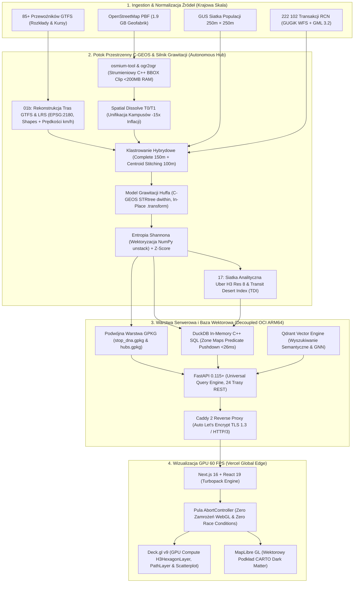
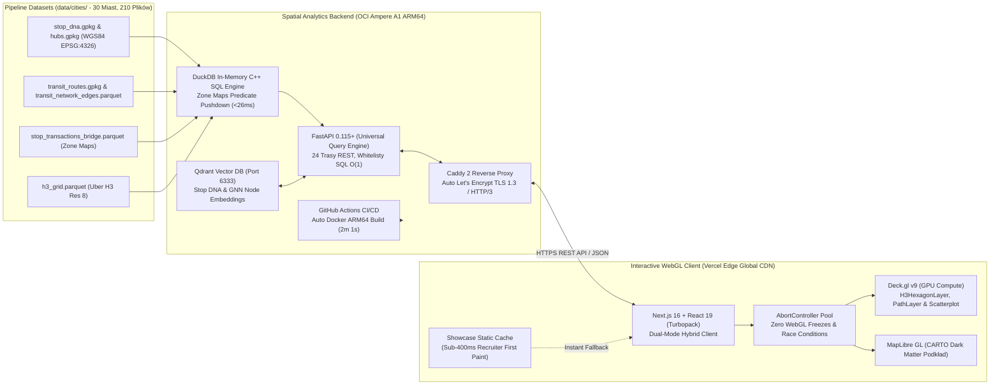

# National Transit Equity & Urban Gravity Platform (Urban Gravity Engine v9.1)

## 1. Project Mission & Analytical Scope

The primary mission of this platform is to provide an empirical, high-fidelity quantification of the causal relationship between public transport accessibility and residential property values across **57 Polish agglomerations and urban centers** (with 30 metropolitan hubs undergoing complete cross-city econometric Z-Score calibration). By integrating high-resolution transit data (GTFS), comprehensive infrastructure context (OpenStreetMap), transactional real estate registries (RCN/GUGiK), and demographic grids (GUS NSP 2021), the system enables advanced modeling of Transit-Oriented Development (TOD) premiums and socio-economic equity.

This platform is not merely a data aggregator; it is a **specialized spatial engineering engine** designed to eliminate "spatial noise". It solves fundamental data science challenges—such as preventing rural train stops from being evaluated like metropolitan hubs, stopping the "Gravity Fallacy" from erasing human populations, and preventing massive shopping malls from being outranked by 30 scattered park benches. 

It acts as a Digital Auditor of Urban Policy, revealing whether cities favor affluent districts or prioritize regional accessibility, while delivering completely clean, mathematically rigorous data sets (Parquet/GPKG) ready for Next.js mapping and deep econometric modeling. Over 60,265 stops, 222,000+ notary transactions, 1.1M+ OSM structures, and 1.4M+ demographic grid cells are processed through this architecture.

### Live Production Deployment & Endpoints
*   **Interactive Spatial Dashboard**: [busos.czerwinskidawid.pl](https://busos.czerwinskidawid.pl) (Hosted on Vercel Global Edge CDN)
*   **Spatial Analytical API & Swagger UI**: [api.busos.czerwinskidawid.pl/docs](https://api.busos.czerwinskidawid.pl/docs) (Hosted on Oracle Cloud Infrastructure Ampere A1 ARM64 behind Caddy 2 TLS 1.3 / HTTP/3)
*   **Real-time Engine Health Telemetry**: [api.busos.czerwinskidawid.pl/health](https://api.busos.czerwinskidawid.pl/health)
*   **Automated CI/CD Pipeline**: GitHub Actions (`.github/workflows/deploy-backend.yml`) with automated Docker ARM64 compilation and zero-downtime deployment.
*   **Unified Analytical H3 Grid API**: [api.busos.czerwinskidawid.pl/api/v1/hexagons?city=kielce](https://api.busos.czerwinskidawid.pl/api/v1/hexagons?city=kielce) (Uber H3 Res 8: Transit Desert Index & Transport Score).
*   **GTFS Transit Routes & LRS Network**: [api.busos.czerwinskidawid.pl/api/v1/routes?city=warszawa](https://api.busos.czerwinskidawid.pl/api/v1/routes?city=warszawa) (Canonical Trip Patterns, Linear Referencing System in EPSG:2180, commercial speed km/h).
*   **Vector Database Engine**: Qdrant v1.13+ (Active on OCI port 6333 for GNN Transit Embeddings)
*   **Audited Coverage**: 30 major Polish metropolitan agglomerations with full econometric calibration (60,265 physical stops, 28,317 logical hubs, 36,784 H3 cells, 210 validated data files, 95/95 Pytest test suite).

### Autonomous API Security & Edge Defense (Caddy + FastAPI)
*   **Perimeter Edge Gate (Caddy 2)**:
    *   **Automated Bot Filtering (`@bad_bots`)**: Immediate `403 Forbidden` response for automated vulnerability scanners (`sqlmap`, `nikto`, `masscan`, `zgrab`, `censys`, `shodan`) and headless scraper libraries (`python-requests`, `aiohttp`, `scrapy`, `urllib`).
    *   **User-Agent Integrity**: Rejection of requests with missing or empty User-Agent headers (`400 Bad Request`).
    *   **HTTPS Enforcement**: Immediate redirect on port `:80` (`redir https://{host}{uri} permanent`).
    *   **Buffer & Payload Armor**: Strict `request_body max_size 1MB` limiting memory pressure from oversized POST requests.
    *   **Security Headers**: Automated `Strict-Transport-Security` (HSTS), `X-Content-Type-Options: nosniff`, `X-Frame-Options: DENY`, `Permissions-Policy`.
*   **Application-Level Defense (FastAPI + SlowAPI)**:
    *   **Sliding-Window Rate Limiting**: Enforced via `slowapi` (`60 req/min` per IP default, emitting standardized HTTP `429 Too Many Requests` and `X-RateLimit-*` headers).
    *   **Strict CORS Whitelist**: Locked down to verified origins (`https://busos.czerwinskidawid.pl`, `localhost:3000`, `*.vercel.app`) with wildcard-credentials disabled.
    *   **Spatial Cache Headers**: Native `Cache-Control: public, max-age=3600, stale-while-revalidate=86400` on spatial GET endpoints.
    *   **DuckDB SQLi Immunity**: 100% parameterized queries (`?`) and strict `ALLOWED_GRADES` whitelisting on dynamic filters (`get_hexagons_ranking`).

---

## 2. Mathematical Architecture: Physics of the City (v13.0 - Rygor Tkanki Miejskiej)

The most critical achievement of this platform is its custom-built **Urban Gravity Engine**, which relies on strict mathematical rules to simulate how humans move, choose services, and assign value to urban spaces. This is divided into three distinct phases: **Macro-Valuation**, **Calibrated Hybrid Clustering**, and **Dynamic Micro-Gravity Distribution**.

### A. Phase I: Macro-Valuation & Spatial Dissolve (Script 14)
**1. The "Spatial Dissolve" Algorithm (v13.0):**
To prevent artificial value inflation, the system unifies fragmented OSM complexes (e.g., a hospital with 15 pavilions) into a single analytical unit.
*   **Target:** Tier T0 (Mega Hubs) and T1 (National Magnets).
*   **Logic:** Buffers objects by 10m, dissolves by `name` and `tier`, and restores geometry. 
*   **Result:** A 15-building campus is treated as **One Object** with summed area, preventing 15x weight multiplication.

**2. The Balanced Tier Matrix (Urban Fabric Rescue):**
Parks and religious sites are demoted to T6 to prioritize commercial/service density.
*   **T0 Mega Hubs:** 5,000,000 pts (Airports, Main Rail).
*   **T1 National Magnets:** 1,000,000 pts (Hospitals, University Campuses).
*   **T2 Strategic Hubs:** 250,000 pts (Malls, Commercial/Industrial Zones).
*   **T3 Local Cores:** 50,000 pts (High Schools, Theatres).
*   **T4 Daily Services:** 10,000 pts (Pharmacies, Banks, Convenience stores).
*   **T5 Specialized Gastro:** 2,500 pts (Restaurants, Hotels).
*   **T6 Micro Infra:** 100 pts (**Parks**, **Churches**, ATMs, Lockers).

### B. Phase II: Calibrated Hybrid Hub Agglomeration (Script 15)
1.  **Semantic Phase:** Group by `norm_name` (150m threshold, `complete` linkage).
2.  **Stitching Phase:** Merge different names (e.g. "Galeria Korona" and "IX Wieków") if centroids are within **100 meters**.

### C. Phase III: Dynamic Micro-Gravity Distribution (Script 15)
**1. Dynamic Diminishing Returns (The High-Street Shield):**
*   **T0 / T1 (National Hubs):** Power = `0.2`. No floor.
*   **T2 (Strategic Hubs - Malls):** Power = `1.2`. **No floor** (Penalty falls to zero).
*   **T4 / T5 (Urban Fabric - Stores/Gastro):** Power = `1.0`. **20% RETENTION FLOOR** (Protects the High Street).
*   **T6 (Micro-Infra - Parks/Spam):** Power = `2.0`. **No floor** (Aggressively hits zero).

**2. Shannon Entropy & Log-Normalized Z-Score:**
`Local_Score = Z(log1p(infra)) * 0.35 + Z(log1p(transit)) * 0.35 + Z(log1p(pop)) * 0.15 + Z(log1p(market)) * 0.15`

---

## 3. System Architecture: The "Autonomous Hub" Model

To ensure 100% scalability, data integrity, and parallel processing capabilities, the project utilizes a decentralized **City Hub** structure. Each of the 30 agglomerations is a self-contained operational unit located in `data/cities/{city_name}/`. This allows for independent processing, validation, and recovery without cross-contamination.

*   **`01_source/`**: The raw ingestion point for local GTFS feeds, regional OSM PBF extracts, and local RCN GML/WFS transactional files.
*   **`02_spatial/`**: Hardened, unified GeoPackage (GPKG) databases:
    *   `stops.gpkg`: Validated transit nodes (Smart Stops).
    *   `infrastructure.gpkg`: Multi-layer OSM data (points/polygons) strictly clipped to the city's transit zone. Preserves the full `all_tags` HSTORE.
    *   `transactions.gpkg`: Unified real estate records with normalized `price_m2` and `lok_pow_uzyt` columns.
    *   `population_250m.gpkg`: A localized, highly efficient demographic grid extracted from the massive national census file.
*   **`03_config/`**: Local intelligence layer containing `poi_valuation.json` (the city's specific "Gravity Price List" calculated by the Engine).
*   **`04_results/`**: Final analytical outputs, including the Stop DNA profiles (GPKG), raw Parquet matrices for frontend API delivery, and equity reports.

---

## 4. The Master Pipeline: 18 Steps to Perfection



The system is fully automated and orchestrated via `orchestrator.py` (The "Pancerny" fault-tolerant runner with Subprocess Isolation). To rebuild the national dataset from scratch, the Orchestrator executes these numbered scripts sequentially from `scripts/pipeline/`.

### Phase 1: Environment, Network Topology & Spatial Isolation
*   **`00_init_environment.py`**: Validates the global directory structure, verifies CRS integrity across the workspace, and prepares the operational grid.
*   **`01_fetch_gtfs.py`**: Multi-threaded sync of 85+ Polish transit operators (ZTM, MPK, PKP).
*   **`01b_extract_transit_routes.py`**: **Transit Route Geometry & Linear Referencing System (LRS).**
    *   Extracts canonical trip patterns with multi-feed isolation key `route_uid = f"{feed_id}_{route_id}"`.
    *   Parses certified GPS tracks from `shapes.txt` (23 cities) or derives interpolated sequences (7 cities).
    *   Implements Linear Referencing System (LRS) in metric EPSG:2180: projects stops onto route geometry to compute true road/track distances ($d_{\text{real}}$) and commercial travel speeds ($v_{\text{kmh}} = \frac{d}{t} \times 3.6$).
    *   Calculates clean net travel time between stops: $\Delta t = \text{arrival}(v) - \text{departure}(u)$ (eliminating dwell-time distortion).
    *   Exports `transit_routes.gpkg`, `stop_route_matrix.parquet`, and directed graph `transit_network_edges.parquet`.
*   **`02_collect_stops.py`**: Unifies Urban and Rail stops. Applies metric BBox buffers in EPSG:2180 (5 km) with auto-sync to `config/extract_config.json`. Normalizes names to alphanumeric core.
*   **`03_download_osm_pbf.py`**: Downloads the 2GB+ National OpenStreetMap binary (Geofabrik).
*   **`04_download_population.py`**: Ingests the National Census (GUS) 250m demographic grid and converts it to EPSG:2180.
*   **`05_extract_infrastructure.py`**: C++ Osmium + OGR high-performance pipeline. Clips the massive Poland PBF strictly to walking buffers of transit stops, saving massive RAM and disk space.
*   **`06_identify_rcn_teryt.py`**: Spatial intersection mapping transit hubs to specific administrative TERYT codes for real estate querying.

### Phase 2: Real Estate Hardening & Spatial Bridge (RCN)
*   **`07_harvest_rcn_omnibus.py`**: Connects to the national WFS (GUGiK) and county registries to download vast XML/GML troves of local real estate transactions. Ingests flat WFS features and handles GML 3.2 multi-layer relational data.
*   **`08_fix_relational_data.py`** *(Dedicated Offline/Rescue Parser)*: Dedicated parser for raw cadastral GML 3.2 packages requiring direct relational XLink pointer resolution.
*   **`09_fix_suwalki_geometry.py`**: Global fallback algorithm restoring valid Point geometries for non-standard real estate multipolygons and cadastral parcel/building centroids.
*   **`10_unify_schemas.py`**: **Quality Real Estate Normalization & Filtering.** Filters exclusively for residential free-market transactions (`lok_funkcja == 'mieszkalna'`, `tran_rodzaj_trans == 'wolnyRynek'`), eliminating 3,800+ garage purchases and 1,700+ discounted municipal buyouts. Enforces columnar `DATE` typing, extracts explicit `lon`/`lat` and Uber H3 Res 8 indices, and applies IQR boundary cleaning.
*   **`11_build_master_db.py`**: Concatenates all verified property records into the National Master Database (over 222,000 verified transactions).

### Phase 3: Urban Intelligence, Symmetry & The Gravity Engine
*   **`12_audit_data_quality.py`**: Mid-flight validation. Verifies coordinate validity, eliminates teleporting stops (0,0 coords), and audits schema compliance.
*   **`13_isolate_city_data.py`**: The "Splinter" process. Cuts the National Master DB and National Population grid into autonomous, localized GeoPackages per city, moving operations to the decentralized `data/cities/` architecture.
*   **`14_build_isc_valuation.py`**: **The Urban Intelligence Engine.** Parses `all_tags` HSTORE, assigns Tiers (T0-T6) based on structural taxonomy, and computes the city-specific monetary weight list (`poi_valuation.json`). Applies Spatial Dissolve to multi-building campuses.
*   **`15_compute_stop_dna.py`**: **The Grand Integrator & Micro-Macro Symmetry.** 
    *   **Subprocess Isolation Architecture**: Enforces isolated subprocessing per city (`subprocess.run`), guaranteeing that the Linux kernel fully reclaims memory arenas and clears swap pages, eliminating OOM Killer and Swap Death crashes across 30-city batch runs.
    *   **Dual-Layer GeoPackage Export**: Generates `stop_dna.gpkg` (60,265 physical stops with complete micro metrics) and `hubs.gpkg` (28,317 logical hub centroid points with macro metrics, `hub_stops_count`, `hub_stops_ids`).
    *   **Zero Stop Loss Symmetry**: Establishes mathematical relationships: `stop_hub_share` ($[0.0, 1.0]$) and exactly one anchor stop per hub (`is_hub_anchor = 1`).
    *   **High-Speed C-GEOS STRtree**: Replaces polygon buffers with allocation-free `shapely.STRtree(points).query(predicate='dwithin', distance=500.0)`, slashing RAM from 28 GB to <200 MB and join times from minutes to 6 milliseconds.
    *   **Pre-Materialized Spatial Bridge**: Materializes `stop_transactions_bridge.parquet` sorted physically by `['stop_id', 'dok_data']` with `row_group_size=50000` for hardware Zone Map Predicate Pushdown in DuckDB.
    *   **Vectorized Shannon Entropy**: Replaces Python loops with matrix unstacking `unstack(fill_value=0.0)` and vectorized log2 arithmetic in NumPy, reducing runtime from 5 minutes to 38 milliseconds on 10k+ stops (GZM).
    *   **Log-Normalized Z-Scores**: Computes robust Z-scores and assigns letter grades (A+ to F).
*   **`16_national_stitching` (`15_compute_stop_dna.py --stitch`)**: **The National Unifier.**
    *   Aggregates city-level datasets across all 30 calibrated Polish cities into `data/database/master_stop_dna_poland.gpkg` (30 MB) and `.csv` (38 MB).
    *   Calculates cross-city log-normalized National Z-Scores calibrated exclusively against unique logical hubs.
    *   Assigns country-wide percentiles (0.0% to 100.0%) across all transit nodes.
*   **`17_build_h3_grid.py`**: **Unified Analytical H3 Grid (Uber H3 Res 8) & Transit Desert Index.**
    *   Fuses GTFS transit supply (departures/h, routes), GUS 250m demographic demand (`pop_total`), RCN property transaction deeds (`rcn_median_price_m2`), and OSM POI gravity into uniform Uber H3 Resolution 8 cells (~0.74 km²).
    *   Calculates the **Transit Desert Index (TDI)**:
        $$TDI = \frac{\ln(1 + \text{pop\_total})}{\ln(1 + \text{total\_departures\_h} + 0.1)}$$
    *   Flags high-deficit exclusion zones (`is_transit_desert = true` when `pop_total >= 150` and `total_departures_h < 4.0`) to power "The Investment List".
    *   Outputs `h3_grid.parquet` per city (36,784 cells across 30 cities in Poland).

---

## 5. Production Cloud Architecture & Interactive Dashboard (`urban-dashboard/`)

The platform employs a decoupled, production-grade cloud architecture separating the ultra-low-latency WebGL visualization layer from the high-throughput spatial analytics engine and vector database.



### Core Production Implementations:
1.  **Decoupled Cloud Serving & Automated CI/CD on Oracle Cloud Infrastructure (OCI)**:
    *   Hosted on an OCI Ampere A1 Compute instance (ARM64, 2 OCPUs, 12 GB RAM) behind a hardened **Caddy 2** reverse proxy with native Let's Encrypt SSL ([api.busos.czerwinskidawid.pl](https://api.busos.czerwinskidawid.pl)).
    *   Fully automated continuous integration and deployment pipeline via **GitHub Actions** (`.github/workflows/deploy-backend.yml`), compiling Docker ARM64 images natively with zero downtime.
    *   API response latency: **<1 ms** for `/health` diagnostics and **<10 ms** for multi-city metadata indexes.
    *   Interactive Swagger / OpenAPI UI live at [api.busos.czerwinskidawid.pl/docs](https://api.busos.czerwinskidawid.pl/docs).
2.  **Universal Query Engine & In-Memory DuckDB C++ SQL**:
    *   Sub-15ms query execution across 60,265 physical stops, 28,317 logical hubs, 36,784 H3 cells, and 2.55M transaction pairs.
    *   1-based exact position querying (`rank=N`) and free `limit` pagination.
    *   100% SQL Injection immunity via strict column whitelisting (`STOP_METRIC_MAP`, `HUB_METRIC_MAP`, `HEX_METRIC_MAP`, `MARKET_METRIC_MAP`) verified in O(1) time.
    *   Hardware Zone Map Predicate Pushdown over physically sorted Parquet tables (`stop_transactions_bridge.parquet` with `row_group_size=50000`), executing dynamic date filters `WHERE dok_data >= ?::DATE` in 12–26 ms.
3.  **Vector Similarity Ready (Qdrant Vector DB)**:
    *   Integrated official Rust **Qdrant** engine on port 6333, connected to FastAPI for AI spatial analysis (GraphSAGE / VGAE embeddings, Transit Deserts, and node similarity).
4.  **Instant-Paint Hybrid Frontend Architecture (Vercel)**:
    *   Next.js 16 App Router with React 19 and Turbopack compilation deployed globally on Vercel Edge ([busos.czerwinskidawid.pl](https://busos.czerwinskidawid.pl)).
    *   **Sub-400ms Recruiter First Paint**: Pre-computed static showcase JSON cache (`/data/showcase/kielce/`) guarantees immediate 3D visualization even during zero-cold-start conditions, seamlessly fetching dynamic multi-city data from the live API in the background.
5.  **Hardware-Accelerated WebGL Rendering (Deck.gl v9)**:
    *   **H3HexagonLayer**: GPU-accelerated 3D hexagonal tessellation colour-coded by Transit Desert Index and transport supply at 60 FPS.
    *   **ScatterplotLayer**: Renders physical stops and transit hubs colour-coded by grade (A+ through F) with 350m elevation caps to prevent raycasting collisions.
    *   **PathLayer**: High-fidelity transit line routes rendered with official agency colors and directional animations.
    *   **AbortController Lifecycle**: Dynamic HTTP fetch cancellation preventing WebGL thread freezing during rapid city switching.

---

## 6. Developer Quickstart & Operational Harness

### Prerequisites
*   **Python**: 3.12+ with C-spatial libraries (`libgdal-dev`, `libgeos-dev`, `osmium-tool`).
*   **Node.js**: 20+ with npm.

### Environment Setup
```bash
# 1. Clone & install Python environment
cd "/home/gzyms/Dev Projects/busos"
uv sync # or: python3 -m venv .venv && source .venv/bin/activate && pip install -r requirements.txt

# 2. Install Dashboard dependencies
cd urban-dashboard
npm install
cd ..
```

### Running the Data Pipeline (`orchestrator.py`)
```bash
# Process a single city (e.g. Kielce)
python3 orchestrator.py --cities kielce --workers 4

# Run the complete national pipeline across all 30 calibrated cities
python3 orchestrator.py --cities all --workers 4

# Force rebuild of all steps (ignoring .pipeline_state.json cache)
python3 orchestrator.py --cities kielce --force-update

# Run a specific pipeline step (e.g. Step 15: Stop DNA)
python3 orchestrator.py --step 15 --cities kielce

# Run National Stitching (Step 16)
python3 scripts/pipeline/15_compute_stop_dna.py --stitch
```

### Managing the Dashboard Lifecycle (`dev.sh`)
The [`dev.sh`](file:///home/gzyms/Dev%20Projects/busos/dev.sh) script provides professional daemon lifecycle management with PID tracking and orphan port resolution:
```bash
./dev.sh start [port]   # Start Next.js in background (default port: 3000)
./dev.sh status         # Check running status, PID, and live port
./dev.sh restart        # Graceful restart with port clean-up
./dev.sh stop           # Terminate PID subtree and clear ports
```

### Running Audits and Tests
```bash
# Run comprehensive unit & integration test suite (95 tests, Tier 0 to Tier 5)
uv run pytest backend/tests/ -v

# Run Python linting and code style checks
uv run ruff check scripts/ backend/

# Run ESLint and TypeScript type-safety checks on dashboard
cd urban-dashboard
npm run lint
npx tsc --noEmit
cd ..

# Verify complete nationwide data files (30 cities, 210 files)
python3 scripts/tools/verify_nationwide_data.py

# Run the Golden Auditor across all generated Stop DNA files
python3 scripts/tools/100_percent_dna_validator.py
```

---

## 7. Tooling & Auditing Suite (`scripts/tools/`)

The platform enforces a "Verify, Then Trust" standard via 18 rigorous auditing and diagnostic tools:

*   **`verify_nationwide_data.py`**: Scans all 30 cities confirming 100% presence and integrity across all 7 essential analytical layers (210/210 complete files).
*   **`100_percent_dna_validator.py` (The Golden Auditor)**: Traverses `stop_dna.gpkg` for all processed cities. Deduplicates logical hubs so reports reflect true physical nodes, validates statistical standard deviations (Z-Scores), audits population drift against raw census counts, and generates comprehensive `GOLDEN_DNA_AUDIT` Markdown reports (26,235 lines).
*   **`test_stop_hub_symmetry.py`**: Rigorous 8-gate verification script confirming zero stop loss, valid `stop_hub_share` ranges $[0.0, 1.0]$, and exactly one anchor stop per hub across 30 cities.
*   **`orchestrator.py`**: Fault-tolerant process manager with Subprocess Isolation, `.pipeline_state.json` persistence, line-buffered subprocessing, and IPC metric parsing (`__PIPELINE_METRICS__=`).

---

## 8. Technical Stack & Engineering Directives

### Full System Stack:
| Layer | Technologies |
|---|---|
| **Data Pipeline Core** | Python 3.12+, GeoPandas 1.0+, Shapely 2.0+ (C-GEOS), NumPy, pandas, scikit-learn, Subprocess Isolation |
| **C/C++ Spatial Engines** | PyOsmium / `osmium-tool`, GDAL/OGR 3.8+ (`ogr2ogr`), C-GEOS STRtree, SciPy `cKDTree` |
| **Data Formats & Storage** | OGC GeoPackage (GPKG with SQLite R-Tree), Apache Parquet (`pyarrow` Zone Maps), Uber H3 (Res 8 & 9) |
| **Coordinate Reference Systems** | EPSG:2180 (Poland CS92 - metric distance & area physics), EPSG:4326 (WGS84 - display export) |
| **Spatial Backend & Vector Engine** | FastAPI 0.115+ (Universal Query Engine, 24 REST routes), DuckDB 1.2+ C++, Qdrant Vector DB (v1.13+), Caddy 2 (TLS 1.3 / HTTP/3) |
| **Frontend & Visualization** | Next.js 16.2.1 (Turbopack), React 19.2+, `@deck.gl` 9.2+ (H3HexagonLayer, Scatterplot, PathLayer), MapLibre GL 5.2+, Zustand 5.0+, Tailwind CSS v4, Blueprint.js |
| **Cloud Infrastructure & CI/CD** | Oracle Cloud Infrastructure Ampere A1 ARM64 (Backend & Vector DB), GitHub Actions CI/CD (`deploy-backend.yml`), Vercel Global Edge CDN (Frontend) |

### Engineering Directives (Senior Engineering Standard):
1.  **C-Level Vectorization First**: Python `apply(lambda)` loops over spatial frames are banned for distance matrices. Calculations reduce to flat NumPy arrays (`x.values`, `y.values`) or native C bindings (`geometry.distance()`).
2.  **No RAM Cartesian Explosions**: Complex `groupby.sum()` followed by `merge()` on multi-million row DataFrames are banned. Memory is preserved using in-place operations like `.transform('sum')`, pre-join deduplication, and explicit `gc.collect()`.
3.  **Absolute Root Cause Analysis (RCA)**: Every system failure undergoes root-cause remediation. Inconsistencies are addressed at their origin (e.g. normalizing stop names at ingestion in Step 02) rather than patched symptomatically downstream.
4.  **Idempotency & Fault Tolerance**: Pipeline stages skip pre-computed, valid data blocks to allow immediate resumption upon restart. State is tracked deterministically in `.pipeline_state.json`.
5.  **Zero Data Fabrication**: Broken or non-geocoded records are quarantined or reconstructed via deterministic spatial geometric fallbacks (e.g. parcel/building centroid derivation), never filled with synthetic approximations.
6.  **Single Source of Truth (SSOT) Architecture**: Core geospatial normalizers (`parse_hstore`, `normalize_name`) and business constants (`CITY_BASELINES`, `TAG_WHITELIST`, `TIER_POINTS`) reside strictly in `scripts/utils/` to eliminate duplicate logic and guarantee 100% unit test coverage.