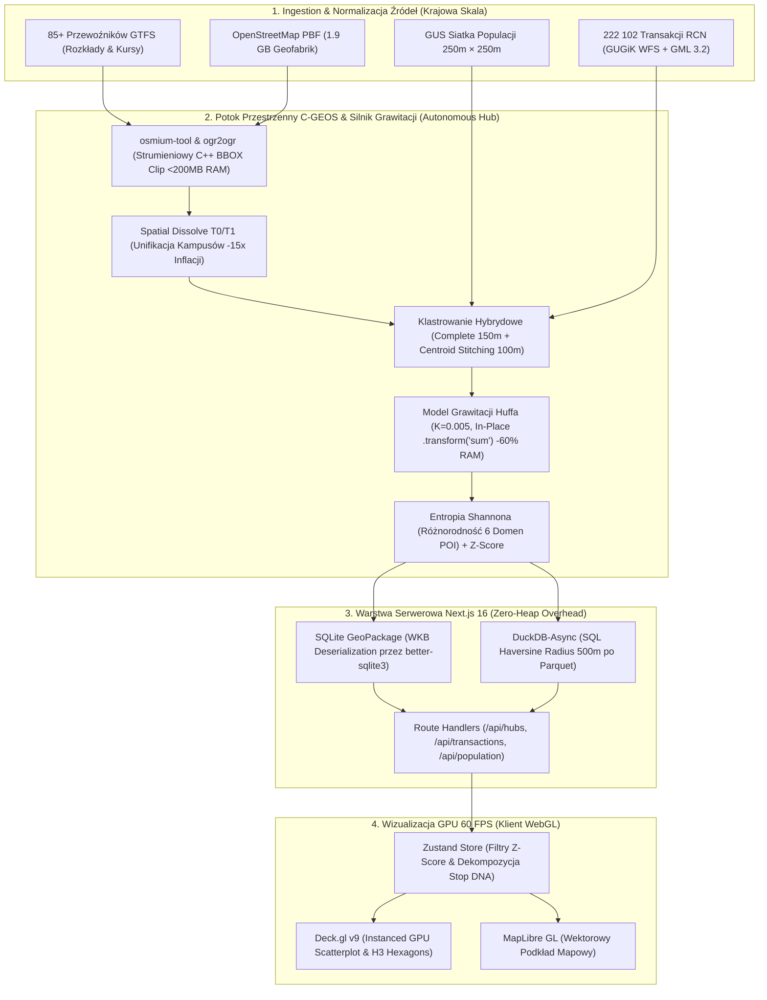
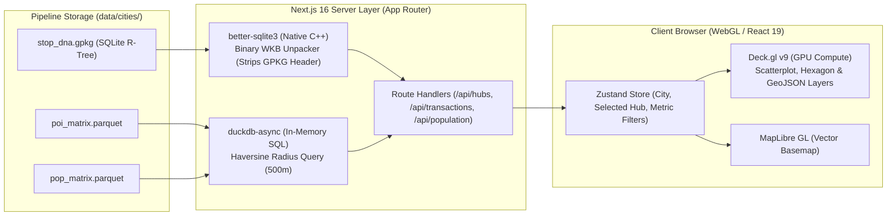

# National Transit Equity & Urban Gravity Platform (Urban Gravity Engine v9.1)

## 1. Project Mission & Analytical Scope

The primary mission of this platform is to provide an empirical, high-fidelity quantification of the causal relationship between public transport accessibility and residential property values across **57 Polish agglomerations and urban centers** (with 30 metropolitan hubs undergoing complete cross-city econometric Z-Score calibration). By integrating high-resolution transit data (GTFS), comprehensive infrastructure context (OpenStreetMap), transactional real estate registries (RCN/GUGiK), and demographic grids (GUS NSP 2021), the system enables advanced modeling of Transit-Oriented Development (TOD) premiums and socio-economic equity.

This platform is not merely a data aggregator; it is a **specialized spatial engineering engine** designed to eliminate "spatial noise". It solves fundamental data science challenges—such as preventing rural train stops from being evaluated like metropolitan hubs, stopping the "Gravity Fallacy" from erasing human populations, and preventing massive shopping malls from being outranked by 30 scattered park benches. 

It acts as a Digital Auditor of Urban Policy, revealing whether cities favor affluent districts or prioritize regional accessibility, while delivering completely clean, mathematically rigorous data sets (Parquet/GPKG) ready for Next.js mapping and deep econometric modeling. Over 60,265 stops, 222,000+ notary transactions, 1.1M+ OSM structures, and 1.4M+ demographic grid cells are processed through this architecture.

---

## 2. Mathematical Architecture: Physics of the City (v13.0 - Rygor Tkanki Miejskiej)

The most critical achievement of this platform is its custom-built **Urban Gravity Engine**, which relies on strict mathematical rules to simulate how humans move, choose services, and assign value to urban spaces. This is divided into three distinct phases: **Macro-Valuation**, **Calibrated Hybrid Clustering**, and **Dynamic Micro-Gravity Distribution**.

### A. Phase I: Macro-Valuation & Spatial Dissolve (Script 14)
**1. The "Spatial Dissolve" Algorithm (v13.0):**
To prevent artificial value inflation, the system unifies fragmented OSM complexes (e.g., a hospital with 15 pavilions) into a single analytical unit.
*   **Target:** Tier T0 (Mega Hubs) and T1 (National Magnets).
*   **Logic:** Buffers objects by 10m, dissolves by `name` and `tier`, and restores geometry. 
*   **Result:** A 15-building campus is treated as **One Object** with summed area, preventing 15x weight multiplication.

**2. The Balanced Tier Matrix (Urban Fabric Rescue):**
Parks and religious sites are demoted to T6 to prioritize commercial/service density.
*   **T0 Mega Hubs:** 5,000,000 pts (Airports, Main Rail).
*   **T1 National Magnets:** 1,000,000 pts (Hospitals, University Campuses).
*   **T2 Strategic Hubs:** 250,000 pts (Malls, Commercial/Industrial Zones).
*   **T3 Local Cores:** 50,000 pts (High Schools, Theatres).
*   **T4 Daily Services:** 10,000 pts (Pharmacies, Banks, Convenience stores).
*   **T5 Specialized Gastro:** 2,500 pts (Restaurants, Hotels).
*   **T6 Micro Infra:** 100 pts (**Parks**, **Churches**, ATMs, Lockers).

### B. Phase II: Calibrated Hybrid Hub Agglomeration (Script 15)
1.  **Semantic Phase:** Group by `norm_name` (150m threshold, `complete` linkage).
2.  **Stitching Phase:** Merge different names (e.g. "Galeria Korona" and "IX Wieków") if centroids are within **100 meters**.

### C. Phase III: Dynamic Micro-Gravity Distribution (Script 15)
**1. Dynamic Diminishing Returns (The High-Street Shield):**
*   **T0 / T1 (National Hubs):** Power = `0.2`. No floor.
*   **T2 (Strategic Hubs - Malls):** Power = `1.2`. **No floor** (Penalty falls to zero).
*   **T4 / T5 (Urban Fabric - Stores/Gastro):** Power = `1.0`. **20% RETENTION FLOOR** (Protects the High Street).
*   **T6 (Micro-Infra - Parks/Spam):** Power = `2.0`. **No floor** (Aggressively hits zero).

**2. Shannon Entropy & Log-Normalized Z-Score:**
`Local_Score = Z(log1p(infra)) * 0.35 + Z(log1p(transit)) * 0.35 + Z(log1p(pop)) * 0.15 + Z(log1p(market)) * 0.15`

---

## 3. System Architecture: The "Autonomous Hub" Model

To ensure 100% scalability, data integrity, and parallel processing capabilities, the project utilizes a decentralized **City Hub** structure. Each of the 30 agglomerations is a self-contained operational unit located in `data/cities/{city_name}/`. This allows for independent processing, validation, and recovery without cross-contamination.

*   **`01_source/`**: The raw ingestion point for local GTFS feeds, regional OSM PBF extracts, and local RCN GML/WFS transactional files.
*   **`02_spatial/`**: Hardened, unified GeoPackage (GPKG) databases:
    *   `stops.gpkg`: Validated transit nodes (Smart Stops).
    *   `infrastructure.gpkg`: Multi-layer OSM data (points/polygons) strictly clipped to the city's transit zone. Preserves the full `all_tags` HSTORE.
    *   `transactions.gpkg`: Unified real estate records with normalized `price_m2` and `lok_pow_uzyt` columns.
    *   `population_250m.gpkg`: A localized, highly efficient demographic grid extracted from the massive national census file.
*   **`03_config/`**: Local intelligence layer containing `poi_valuation.json` (the city's specific "Gravity Price List" calculated by the Engine).
*   **`04_results/`**: Final analytical outputs, including the Stop DNA profiles (GPKG), raw Parquet matrices for frontend API delivery, and equity reports.

---

## 4. The Master Pipeline: 16 Steps to Perfection



The system is fully automated and orchestrated via `orchestrator.py` (The "Pancerny" fault-tolerant runner). To rebuild the national dataset from scratch, the Orchestrator executes these numbered scripts sequentially from `scripts/pipeline/`.

### Phase 1: Environment & Spatial Isolation
*   **`00_init_environment.py`**: Validates the global directory structure, verifies CRS integrity across the workspace, and prepares the operational grid.
*   **`01_fetch_gtfs.py`**: Multi-threaded sync of 85+ Polish transit operators (ZTM, MPK, PKP).
*   **`02_collect_stops.py`**: Unifies Urban and Rail stops. Applies the crucial `normalize_name` regex function (stripping strings to raw alphanumeric core) to ensure perfect Agglomerative Clustering later. Identifies massive transport radii.
*   **`03_download_osm_pbf.py`**: Downloads the 2GB+ National OpenStreetMap binary (Geofabrik).
*   **`04_download_population.py`**: Ingests the National Census (GUS) 250m demographic grid and converts it to EPSG:2180.
*   **`05_extract_infrastructure.py`**: C++ Osmium + OGR high-performance pipeline. Clips the massive Poland PBF strictly to the 1.5km walking buffers of transit stops, saving massive amounts of RAM and disk space.
*   **`06_identify_rcn_teryt.py`**: Spatial intersection mapping transit hubs to specific administrative TERYT codes for real estate querying.

### Phase 2: Real Estate Hardening (RCN)
*   **`07_harvest_rcn_omnibus.py`**: Connects to the national WFS (GUGiK) and county registries to download vast XML/GML troves of local real estate transactions. Ingests flat WFS features and handles GML 3.2 multi-layer relational data.
*   **`08_fix_relational_data.py`** *(Decommissioned / Integrated)*: Relational XLink pointer resolution formerly in Step 08 was hardened directly into Step 07 and Step 09, leaving this step bypassed in orchestrator execution.
*   **`09_fix_suwalki_geometry.py`**: Global fallback algorithm restoring valid Point geometries for non-standard real estate multipolygons and cadastral parcel/building centroids (covering edge cases like Suwałki and Łódź).
*   **`10_unify_schemas.py`**: Aggressive standardization of thousands of disjointed local RCN columns into a strict, unified economic format (`price_m2`, `lok_pow_uzyt`, date) with IQR boundary cleaning.
*   **`11_build_master_db.py`**: Concatenates all verified property records into the National Master Database (over 222,000 verified transactions).

### Phase 3: Urban Intelligence & The Gravity Engine
*   **`12_audit_data_quality.py`**: Mid-flight validation. Verifies coordinate validity, eliminates teleporting stops (0,0 coords), and audits schema compliance.
*   **`13_isolate_city_data.py`**: The "Splinter" process. Cuts the National Master DB and National Population grid into autonomous, localized GeoPackages per city, moving operations to the decentralized `data/cities/` architecture.
*   **`14_build_isc_valuation.py`**: **The Urban Intelligence Engine.** Parses the complex `all_tags` HSTORE of every building. Assigns Tiers (T0-T6) based on structural taxonomy (e.g., recognizing `uic_ref` to designate a National Rail Hub instead of just a generic station). Incorporates base city population logs and physical volume metrics to calculate the definitive Monetary Weight of every POI category in the city (`poi_valuation.json`). Applies Spatial Dissolve to multi-building campuses.
*   **`15_compute_stop_dna.py`**: **The Grand Integrator.** 
    *   Merges Stops into Logical Hubs via two-phase clustering (complete linkage 150m + centroid stitching 100m).
    *   Computes GTFS unique departures per hour with Dirty GTFS calendar resilience (Wednesday typical day heuristic).
    *   Calculates C-GEOS vectorized Euclidean distances to POIs.
    *   Solves Huff Models strictly in-place (`.transform('sum')`) to eliminate RAM Cartesian explosions.
    *   Applies Tier-based Dynamic Diminishing Returns with a 20% Retention Floor on daily services (T4/T5) and quadratic penalties on micro-infrastructure (T6).
    *   Integrates the GUS 250m population grid via demand cannibalization, preserving 100% human population mass.
    *   Calculates Shannon Entropy across functional domains (Health, Education, Commerce, Leisure, Government, Transport) as an Urban Synergy Bonus.
    *   Computes log-normalized Z-Scores and assigns letter grades (A+ to F).
    *   Exports high-speed `.parquet` matrices and `.gpkg` vectors in EPSG:4326 for frontend delivery.
*   **`16_national_stitching` (`15_compute_stop_dna.py --stitch`)**: **The National Unifier.**
    *   Aggregates city-level `stop_dna.gpkg` datasets across all processed cities into `data/database/master_stop_dna_poland.gpkg` and `.csv`.
    *   Calculates cross-city log-normalized National Z-Scores calibrated exclusively against unique logical hubs to prevent over-represented multi-stop nodes from skewing the national distribution.
    *   Assigns country-wide percentiles (from 0.03% to 100.00%) across all 60,000+ transit nodes.

---

## 5. End-to-End Delivery Architecture & Interactive Dashboard (`urban-dashboard/`)

The platform includes a dedicated, full-stack visualization and analysis dashboard located in [`urban-dashboard/`](file:///home/gzyms/Dev%20Projects/busos/urban-dashboard/), connecting raw pipeline outputs to an interactive WebGL interface.



### Core Technical Implementations:
1.  **Zero-IPC Binary Geometry Deserialization**: The Next.js API layer connects directly to local GeoPackages via `better-sqlite3`. By reading raw SQLite geometry blobs, stripping the 8-byte GeoPackage header and envelope flags in memory, and parsing WKB payloads via `wkx`, the server streams GeoJSON features to the client with sub-millisecond overhead.
2.  **In-Memory Parquet Filtering with DuckDB**: Rather than holding multi-million POI and population records in Node.js heap memory, server route handlers spin up ephemeral in-memory DuckDB sessions (`duckdb-async`). DuckDB executes vectorised Haversine distance filters directly over Parquet files on disk:
    ```sql
    SELECT poi_id, name, category, tier, lat, lon, w, sum_pull
    FROM read_parquet('poi_matrix.parquet')
    WHERE lat BETWEEN :minLat AND :maxLat
      AND lon BETWEEN :minLon AND :maxLon
      AND (6371000 * acos(
            cos(radians(:lat)) * cos(radians(lat)) * cos(radians(lon) - radians(:lon)) +
            sin(radians(:lat)) * sin(radians(lat))
          )) <= 500
    ORDER BY (w * sum_pull) DESC
    ```
3.  **Hardware-Accelerated WebGL Rendering (Deck.gl v9)**:
    *   **ScatterplotLayer**: Renders tens of thousands of transit hubs colour-coded by grade (A+ through F) at 60 FPS.
    *   **HexagonLayer / GeoJSONLayer**: Visualises H3 spatial hexagons and real estate transaction density.
    *   **Interactive Node Inspection**: Deep-dive sidebar profiling catchment radius, functional domain entropy, and local vs national percentiles.

---

## 6. Developer Quickstart & Operational Harness

### Prerequisites
*   **Python**: 3.12+ with C-spatial libraries (`libgdal-dev`, `libgeos-dev`, `osmium-tool`).
*   **Node.js**: 20+ with npm.

### Environment Setup
```bash
# 1. Clone & install Python environment
cd "/home/gzyms/Dev Projects/busos"
uv sync # or: python3 -m venv .venv && source .venv/bin/activate && pip install -r requirements.txt

# 2. Install Dashboard dependencies
cd urban-dashboard
npm install
cd ..
```

### Running the Data Pipeline (`orchestrator.py`)
```bash
# Process a single city (e.g. Kielce)
python3 orchestrator.py --cities kielce --workers 4

# Run the complete national pipeline across all 57 cities
python3 orchestrator.py --cities all --workers 4

# Force rebuild of all steps (ignoring .pipeline_state.json cache)
python3 orchestrator.py --cities kielce --force-update

# Run a specific pipeline step (e.g. Step 15: Stop DNA)
python3 orchestrator.py --step 15 --cities kielce

# Run National Stitching (Step 16)
python3 scripts/pipeline/15_compute_stop_dna.py --stitch
```

### Managing the Dashboard Lifecycle (`dev.sh`)
The [`dev.sh`](file:///home/gzyms/Dev%20Projects/busos/dev.sh) script provides professional daemon lifecycle management with PID tracking and orphan port resolution:
```bash
./dev.sh start [port]   # Start Next.js in background (default port: 3000)
./dev.sh status         # Check running status, PID, and live port
./dev.sh restart        # Graceful restart with port clean-up
./dev.sh stop           # Terminate PID subtree and clear ports
```

### Running Audits and Tests
```bash
# Run unit tests
pytest tests/ -v

# Run the Golden Auditor across all generated Stop DNA files
python3 scripts/tools/100_percent_dna_validator.py

# Verify TypeScript type-safety in dashboard
cd urban-dashboard && npx tsc --noEmit && cd ..
```

---

## 7. Tooling & Auditing Suite (`scripts/tools/`)

The platform enforces a "Verify, Then Trust" standard via 18 rigorous auditing and diagnostic tools:

*   **`100_percent_dna_validator.py` (The Golden Auditor)**: Traverses `stop_dna.gpkg` for all processed cities. Deduplicates logical hubs so reports reflect true physical nodes, validates statistical standard deviations (Z-Scores), audits population drift against raw census counts, and generates comprehensive `GOLDEN_DNA_AUDIT` Markdown reports.
*   **`orchestrator.py`**: Fault-tolerant process manager with thread-safe execution, `.pipeline_state.json` persistence for interrupted runs, line-buffered subprocessing, and IPC metric parsing (`__PIPELINE_METRICS__=`).
*   **`master_national_auditor.py` & `comprehensive_national_audit.py`**: Cross-city integrity scanners ensuring schema uniformity, zero-null constraints, and valid spatial bounds across the national repository.
*   **`verify_isolation.py` & `dry_run_rcn_audit.py`**: Boundary checkers confirming zero data cross-contamination between city directories.

---

## 8. Technical Stack & Engineering Directives

### Full System Stack:
| Layer | Technologies |
|---|---|
| **Data Pipeline Core** | Python 3.12+, GeoPandas, Shapely 2.0+, NumPy, pandas, scikit-learn |
| **C/C++ Spatial Engines** | PyOsmium / `osmium-tool`, GDAL/OGR 3.8+ (`ogr2ogr`), C-GEOS bindings |
| **Data Formats & Storage** | OGC GeoPackage (GPKG with SQLite R-Tree), Apache Parquet (`pyarrow`/`fastparquet`), H3 Spatial Index (Uber H3 Res 9) |
| **Coordinate Reference Systems** | EPSG:2180 (Poland CS92 - metric distance & area physics), EPSG:4326 (WGS84 - display export) |
| **Backend & Delivery** | Next.js 16.2.1 (App Router), `duckdb-async` 1.4+, `better-sqlite3` 12.8+, `wkx` |
| **Frontend & Visualization** | React 19.2+, `@deck.gl` 9.2+ (Scatterplot, Hexagon, GeoJSON layers), `maplibre-gl` 5.2+, Zustand 5.0+, Tailwind CSS v4, shadcn/ui |
| **Orchestration & DevOps** | Custom Python ThreadPoolOrchestrator, Bash daemon harness (`dev.sh`), JSON state machine |

### Engineering Directives (Senior Engineering Standard):
1.  **C-Level Vectorization First**: Python `apply(lambda)` loops over spatial frames are banned for distance matrices. Calculations reduce to flat NumPy arrays (`x.values`, `y.values`) or native C bindings (`geometry.distance()`).
2.  **No RAM Cartesian Explosions**: Complex `groupby.sum()` followed by `merge()` on multi-million row DataFrames are banned. Memory is preserved using in-place operations like `.transform('sum')`, pre-join deduplication, and explicit `gc.collect()`.
3.  **Absolute Root Cause Analysis (RCA)**: Every system failure undergoes root-cause remediation. Inconsistencies are addressed at their origin (e.g. normalizing stop names at ingestion in Step 02) rather than patched symptomatically downstream.
4.  **Idempotency & Fault Tolerance**: Pipeline stages skip pre-computed, valid data blocks to allow immediate resumption upon restart. State is tracked deterministically in `.pipeline_state.json`.
5.  **Zero Data Fabrication**: Broken or non-geocoded records are quarantined or reconstructed via deterministic spatial geometric fallbacks (e.g. parcel/building centroid derivation), never filled with synthetic approximations.