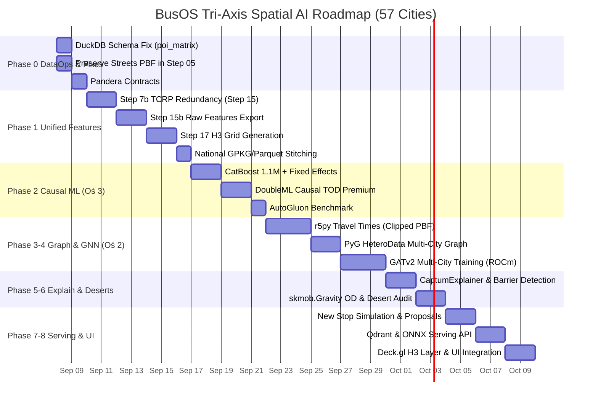

# AI_PLAN.md — BusOS National Tri-Axis Spatial & Mobility Intelligence Engine

> Engineering specification for implementing AI/ML in the BusOS urban transit analysis and equity platform.
> Master SSOT Revision 8.0 — Scaled across 57 Polish agglomerations (1,104,389 RCN transactions, 60,265 transit stops).
> Fully compliant with Spec-Driven Development, Living Document Integrity, and TCRP Report 100 transit standards.

---

## 0. Scope Definition & System Architecture

### 0.1 Target Scale: National Parity (57 Agglomerations) with Calibration Hub
- **Geographic Scope:** 57 calibrated Polish cities and metropolitan areas (60,265 physical transit stops, 1,104,389 validated RCN notary transactions, 2,800+ GTFS routes).
- **Calibration & Ground-Truth Hub:** Kielce (1,357 stops, 9,550 RCN transactions, 7,293 categorized POIs, 4,623 demographic grid cells) serves as the ground-truth benchmark node for local parameter verification.
- **National Data Baseline:**
  - `data/database/master_analytical.gpkg` (540 MB): 60,265 stops, 1,104,389 RCN transactions.
  - `data/database/master_stop_dna_poland.gpkg` (18.6 MB): 60,265 stops with grades A+ to F.
  - Pipelines 00–16 status: `SUCCESS` across all 57 cities.

### 0.2 System Architecture: The Tri-Axis Engine

```
                            ┌─────────────────────────────────────────┐
                            │    BusOS National Tri-Axis Platform     │
                            └────────────────────┬────────────────────┘
                                                 │
         ┌───────────────────────────────────────┼───────────────────────────────────────┐
         ▼                                       ▼                                       ▼
┌─────────────────────────┐             ┌─────────────────────────┐             ┌─────────────────────────┐
│         OŚ 1:           │             │         OŚ 2:           │             │         OŚ 3:           │
│   Matematyka i Fizyka   │             │   AI Użyteczności Sieci │             │    AI Wyceny i Rynku    │
│    (Deterministyczna)   │             │     (Transit-First ML)  │             │   (Causal Real Estate)  │
├─────────────────────────┤             ├─────────────────────────┤             ├─────────────────────────┤
│ • Model Huffa & Entropia│             │ • Wielomiasteczkowy GNN │             │ • 1.1M transakcji RCN   │
│ • Zanik wykładniczy v13 │             │   (PyG GATv2 Batches)   │             │ • Causal TOD Premium    │
│ • TCRP 100 Redundancy   │             │ • Czasy dojścia r5py    │             │   (DoubleML / EconML)   │
│ • "The Axe List"        │             │ • "The Investment List" │             │ • City Fixed Effects    │
│ • Z-Score Stop DNA      │             │ • Pustynie i overserved │             │ • Predykcja cen mieszkań│
│   (Kroki 14–16 potoku)  │             │   (skmob.Gravity OD)    │             │   (CatBoost / AutoGluon)│
│ • Zero black-boxa       │             │ • Wyszukiwarka Qdrant   │             │ • Affluent vs Social    │
│ • DuckDB Parquet engine │             │   (anomalie sieciowe)   │             │   (Transit Equity Index)│
└─────────────────────────┘             └─────────────────────────┘             └─────────────────────────┘
```

### 0.3 Core Mathematical Foundations (Zero Speculation)

#### 1. Functional Transit Gravity Centroid (Objective CBD)
City center coordinates must never be hardcoded or visually guessed. For any city with $N$ stops at coordinates $(X_i, Y_i)$ and hourly departure frequencies $\text{Freq}_i$:
$$\mathbf{C}_{\text{CBD}} = \left( \frac{\sum_{i=1}^N \text{Freq}_i \cdot X_i}{\sum_{i=1}^N \text{Freq}_i}, \quad \frac{\sum_{i=1}^N \text{Freq}_i \cdot Y_i}{\sum_{i=1}^N \text{Freq}_i} \right)$$
This produces a deterministic, data-driven center of gravity for all 57 cities directly from GTFS.

#### 2. Asymmetric Redundancy Index (TCRP Report 100 Standard)
For any pair of stops $A$ and $B$ within network walking distance $d(A, B) \le 200\text{ m}$:
$$R(B \to A) = S_{\text{service}}(B \to A) \times S_{\text{spatial}}(A, B) \times S_{\text{cannibalization}}(B \to A)$$
Where:
1. **Service Overlap Index:**
   $$S_{\text{service}}(B \to A) = \frac{|\text{Lines}_B \cap \text{Lines}_A|}{|\text{Lines}_B|}$$
   Extracted from GTFS (`routes.txt`, `trips.txt`, `stop_times.txt`).
2. **Gaussian Spatial Decay:**
   $$S_{\text{spatial}}(A, B) = \exp\left( -\frac{1}{2} \left( \frac{d(A, B)}{100} \right)^2 \right)$$
3. **Demand Cannibalization:**
   $$S_{\text{cannibalization}}(B \to A) = 1 - \frac{\text{Demand}(B \setminus A)}{\text{Demand}(B)}$$
   Computed via C-GEOS geometric difference between 300m buffers around $B$ and $A$ using GUS `population_250m.gpkg`.
A stop $B$ with $R_{\max}(B) \ge 0.70$ is flagged `is_redundant = True` and placed on **"The Axe List"** for consolidation.

#### 3. Unified Analytical H3 Grid (Res 8 / 9)
Pre-computed hexagonal cells containing:
- `transport_score`: Stop count, total departures/h, unique lines, max Stop DNA grade.
- `pop_total`: Aggregated GUS NSP 2021 population.
- `rcn_median_price_m2`: Median price/m² from notary transactions.
- `poi_gravity_sum`: Total gravity score of amenities.
- `transit_desert_index`: Demographic demand relative to transit supply:
  $$\text{TDI}_{\text{hex}} = \frac{\log(1 + \text{Pop}_{\text{hex}})}{\log(1 + \text{Departures}_{\text{hex}} + 0.1)}$$
High $\text{TDI}$ cells populate **"The Investment List"**.

### 0.4 Hardware Constraints

| Component | Spec | Operating Limit |
|---|---|---|
| GPU | AMD Radeon RX 9060 XT 16GB (RDNA 4, `gfx1200`) | 16 GB VRAM, PyG NeighborLoader (batch 128 < 1.5 GB VRAM) |
| RAM | 32 GB DDR5 | r5py capped at 6 GB (`r5py.set_max_memory("6G")`) on city street PBF |
| CPU | Intel Core i5-14600KF (14C/20T) | Parallel r5py routing and C-GEOS spatial joins |
| Storage | NVMe 1TB PCIe Gen4 | Parquet/GeoPackage storage for 1.1M transactions (<2 GB) |
| OS | Ubuntu 24.04 LTS | Native ROCm 7.2 |

### 0.5 Success Metrics Across Axes

| Metric | Axis 1 (Physics) | Axis 2 (Network Utility) | Axis 3 (Market Valuation) | Strategic Significance |
|---|---|---|---|---|
| Redundancy Detection Rate | >90% precision on stops <150m | Edge attention pruning | N/A | "The Axe List" operational cost reduction |
| MAE / R2 on price_m2 | N/A | Moran's I residual drop | Baseline (CatBoost) vs Ceiling (AutoGluon) | Property valuation accuracy across Poland |
| Causal TOD Premium | N/A | Pedestrian attention weights | DoubleML partialling-out on Y_rel | Clean policy-grade PLN/m² value per bus/hour |
| Transit Desert Coverage | Demand/Supply ratio | skmob.Gravity OD flows | Socio-economic correlation | "The Investment List" for transit equity |

---

## 1. Phase 0: Environment Setup & Experiment Registry

### 1.1 ROCm + PyTorch Configuration
Verify ROCm 7.2 hardware acceleration on `gfx1200`:
```bash
rocminfo | grep gfx1200
python -c "import torch; print(f'ROCm Available: {torch.cuda.is_available()} | Device: {torch.cuda.get_device_name(0)}')"
```

### 1.2 PyTorch Geometric (Native HeteroData)
Source build for ROCm extensions or native PyG fallback:
```bash
pip install torch-geometric
# Build extensions if needed:
# git clone https://github.com/pyg-team/pyg-lib.git && cd pyg-lib && pip install -e . --no-build-isolation
python -c "import torch_geometric; print(f'PyG Version: {torch_geometric.__version__}')"
```

### 1.3 r5py & OpenJDK 21
```bash
sudo apt install openjdk-21-jdk
pip install r5py
```
Memory limit configuration:
```python
import r5py
r5py.set_max_memory("6G")
```

### 1.4 Production Requirements File (`requirements-ai.txt`)
```text
# Deep Learning & Graph
torch>=2.6.0
torch-geometric>=2.6.0

# Spatial Geometry & Routing
r5py>=1.1.0
geopandas>=1.0.0
shapely>=2.0.0
pyarrow>=17.0.0
h3>=4.0.0
pandera[geopandas]>=0.22.0

# Tabular, Causal & Mobility ML
catboost>=1.2.0
xgboost>=2.1.0
scikit-learn>=1.5.0
doubleml>=0.7.0
scikit-mobility>=1.3.1
autogluon.tabular>=1.2.0

# Interpretability & Spatial Stats
captum>=0.7.0
esda>=2.6.0
libpysal>=4.10.0

# Serving & Telemetry
fastapi>=0.115.0
uvicorn>=0.30.0
duckdb>=1.2.0
qdrant-client>=1.12.0
```

### Acceptance Criteria — Phase 0
- [ ] `torch.cuda.is_available()` returns `True` for Radeon RX 9060 XT (`gfx1200`).
- [ ] `torch_geometric` imports successfully.
- [ ] `r5py.TransportNetwork` initializes with `{city}_streets.osm.pbf`.
- [ ] `pandera` validates GeoDataFrames.

---

## 2. Phase 1: Data Preparation & Spatial Contracts

### 2.1 Pipeline Modifications
1. **[05_extract_infrastructure.py](file:///home/gzyms/Dev%20Projects/busos/scripts/pipeline/05_extract_infrastructure.py):**
   - Retain `{city}_streets.osm.pbf` permanently instead of deleting it.
   - Preserves local ~25 MB street networks for r5py routing without feeding national 2 GB PBF.
2. **[08_fix_relational_data.py](file:///home/gzyms/Dev%20Projects/busos/scripts/pipeline/08_fix_relational_data.py) & [09_fix_suwalki_geometry.py](file:///home/gzyms/Dev%20Projects/busos/scripts/pipeline/09_fix_suwalki_geometry.py):**
   - Append `repair_source` and `repair_confidence` columns to allow AI models to filter clean vs repaired records.
3. **[15_compute_stop_dna.py](file:///home/gzyms/Dev%20Projects/busos/scripts/pipeline/15_compute_stop_dna.py):**
   - **Step 7b: TCRP Report 100 Asymmetric Redundancy:** Calculate line overlap from GTFS, Gaussian spatial decay, and C-GEOS demographic cannibalization.
   - **DuckDB Fix:** Preserve `name`, `category`, and `tier` columns in `04_results/poi_matrix.parquet`.
4. **[backend/app/spatial_engine.py](file:///home/gzyms/Dev%20Projects/busos/backend/app/spatial_engine.py):**
   - Add schema fallback introspection with `COALESCE` to eliminate HTTP 500 errors.
   - Expose endpoint `GET /api/v1/hexagons?city={city}`.

### 2.2 Script: `15b_export_raw_features.py`
Export un-weighted, raw feature matrix per stop:
- Location: `scripts/pipeline/15b_export_raw_features.py`
- Arguments: `--city {city}` or `--stitch` (consolidates 57 cities to `data/database/master_features_ai.parquet`).
- Schema (31 columns):
  - Identifiers: `stop_id`, `stop_name`, `norm_name`, `lat`, `lon`, `x_2180`, `y_2180`, `city_name`.
  - Transit: `transit_freq` (departures/h), `transit_routes_unique`, `transit_span_hours`.
  - Demographics: `pop_250m_total`, `pop_250m_cells_count`.
  - Market: `rcn_median_price_m2`, `rcn_transaction_count`, `rcn_mean_area_m2`.
  - Infrastructure: POI counts and nearest distances across 6 domains (Health, Education, Commerce, Leisure, Government, Transport).
  - Spatial: `dist_to_cbd` (distance to Functional Transit Gravity Centroid).

### 2.3 Script: `17_generate_h3_grid.py`
Generate the Unified Analytical H3 Grid (Res 8 / 9):
- Location: `scripts/pipeline/17_generate_h3_grid.py`
- Output: `04_results/h3_grid.parquet` per city and `data/database/master_h3_grid.parquet` nationally.
- Attributes: `h3_index`, `transport_score`, `pop_total`, `rcn_median_price_m2`, `rcn_volume`, `poi_gravity_sum`, `transit_desert_index`.

### Acceptance Criteria — Phase 1
- [ ] `{city}_streets.osm.pbf` preserved in all city directories.
- [ ] `15_compute_stop_dna.py` outputs `is_redundant` and preserves POI metadata.
- [ ] `15b_export_raw_features.py --stitch` produces 60,265 rows.
- [ ] `17_generate_h3_grid.py` generates clean Parquet files for 57 cities.
- [ ] Backend DuckDB endpoint `/api/v1/hubs/1/details?city=warszawa` returns HTTP 200.

---

## 3. Phase 2: Market & Causal ML (Axis 3)

### 3.1 Problem Formulation & Spatial Non-Stationarity
Real estate prices across Poland vary by ~300% ($4,124 PLN/m² in Giżycko vs $11,565 PLN/m² in Świnoujście). A naive pooled model conflates baseline city wealth with transit supply.
- **Remedy:** Train CatBoost with `city_context` as a categorical feature (City Fixed Effects) using H3 Res-7 spatial block cross-validation.
- **Causal Target:** Relative price target in DoubleML:
  $$Y_{\text{rel}} = \frac{\text{price\_m2}}{\text{city\_median\_price}}$$

### 3.2 Double Machine Learning (Causal TOD Premium)
Isolate the true marginal willingness-to-pay for transit frequency while controlling for confounding variables:
```python
from doubleml import DoubleMLPLR, DoubleMLData
import catboost as cb

# Partialling out confounders from both transit frequency and relative price
confounders = ['dist_to_cbd', 'pop_250m_total', 'poi_count_commerce', 'poi_count_health', 'mean_area_m2']
dml_data = DoubleMLData(df, y_col='price_rel', d_cols='transit_freq', x_cols=confounders)

ml_l = cb.CatBoostRegressor(iterations=500, verbose=0)
ml_m = cb.CatBoostRegressor(iterations=500, verbose=0)

dml_plr = DoubleMLPLR(dml_data, ml_l, ml_m, n_folds=5)
dml_plr.fit()
print(f"Causal TOD Effect: {dml_plr.coef} (p-val: {dml_plr.pval})")
```

### 3.3 Transit Equity Index (Affluent vs Social)
Evaluate whether transit frequency disproportionately favors wealthy neighborhoods:
- Correlate stop-level departures with RCN median price tiers within city boundaries.
- Generate inequality curves showing service distribution across wealth deciles.

### 3.4 AutoGluon Benchmark Ceiling
Execute optional stacked ensemble (`--benchmark-autogluon`) with H3 spatial grouping to establish the theoretical upper bound for tabular prediction accuracy.

### Acceptance Criteria — Phase 2
- [ ] CatBoost R2 > 0.65 on spatially held-out test set across 1.1M transactions.
- [ ] DoubleML isolates statistically significant causal parameter on $Y_{\text{rel}}$ controlling for `dist_to_cbd`.
- [ ] Transit Equity Index computed for all 57 cities.
- [ ] Moran's I of regression residuals documented.

---

## 4. Phase 3: Graph Construction (Axis 2)

### 4.1 Walking Network Matrix via r5py
Compute true pedestrian network travel times:
```python
import r5py
from datetime import datetime, timedelta

r5py.set_max_memory("6G")
network = r5py.TransportNetwork(
    osm_pbf=f"data/cities/{city}/02_spatial/{city}_streets.osm.pbf"
)

# r5py strictly requires an 'id' column
origins = stops_gdf[['stop_id', 'geometry']].rename(columns={'stop_id': 'id'})
destinations = pois_gdf[['poi_id', 'geometry']].rename(columns={'poi_id': 'id'})

matrix = r5py.TravelTimeMatrix(
    transport_network=network,
    origins=origins,
    destinations=destinations,
    transport_modes=[r5py.TransportMode.WALK],
    departure=datetime(2026, 7, 7, 8, 0),
    max_time=timedelta(minutes=20),
)
```

### 4.2 PyG HeteroData Construction (IndexError Safe)
Prevent PyG indexing crashes by mapping non-contiguous POI IDs into contiguous integer ranges:
```python
import torch
from torch_geometric.data import HeteroData

data = HeteroData()

stop_map = {sid: i for i, sid in enumerate(stops['stop_id'])}
poi_map = {pid: i for i, pid in enumerate(pois['poi_id'])}

valid = matrix.dropna(subset=['travel_time'])
src = [stop_map[sid] for sid in valid['from_id'] if sid in stop_map]
dst = [poi_map[pid] for pid in valid['to_id'] if pid in poi_map]

data['stop'].x = torch.tensor(stop_features, dtype=torch.float)
data['poi'].x = torch.tensor(poi_features, dtype=torch.float)
data['stop', 'walks_to', 'poi'].edge_index = torch.tensor([src, dst], dtype=torch.long)
data['stop', 'walks_to', 'poi'].edge_attr = torch.tensor(valid['travel_time'].values, dtype=torch.float).unsqueeze(-1)
```

### Acceptance Criteria — Phase 3
- [ ] r5py computes walking times without exceeding 6 GB RAM.
- [ ] HeteroData constructed without `IndexError` or isolated stop nodes.
- [ ] Graph saved to `04_results/{city}_graph.pt`.

---

## 5. Phase 4: GNN Training (Axis 2)

### 5.1 Multi-City GATv2 Architecture
Graph Attention Network capturing pedestrian topology and amenity interactions:
```python
import torch
import torch.nn.functional as F
from torch_geometric.nn import GATv2Conv

class TransitGATv2(torch.nn.Module):
    def __init__(self, in_channels, hidden_channels=64, heads=4):
        super().__init__()
        self.conv1 = GATv2Conv(in_channels, hidden_channels, heads=heads, edge_dim=1, add_self_loops=False)
        self.conv2 = GATv2Conv(hidden_channels * heads, hidden_channels, heads=1, edge_dim=1, add_self_loops=False)
        self.head = torch.nn.Linear(hidden_channels, 1)

    def forward(self, x, edge_index, edge_attr):
        h = F.elu(self.conv1(x, edge_index, edge_attr))
        h = F.dropout(h, p=0.2, training=self.training)
        embeddings = F.elu(self.conv2(h, edge_index, edge_attr))
        out = self.head(embeddings)
        return out.squeeze(-1), embeddings
```

### 5.2 Multi-City Batching & NeighborLoader
- Train across multiple cities simultaneously using PyG `DataLoader`, treating each city as a disconnected subgraph.
- Use `NeighborLoader` (batch size 128, sampling [15, 10] neighbors) to keep VRAM consumption under 1.5 GB on the RX 9060 XT.
- Export 64-dimensional topological embeddings (`embeddings_64d`) for all 60,265 stops.

### Acceptance Criteria — Phase 4
- [ ] GATv2 trains without OOM on RX 9060 XT.
- [ ] Moran's I of GNN residuals is lower than flat regression models.
- [ ] Checkpoints and 64D embeddings saved to `04_results/`.

---

## 6. Phase 5: Interpretability & Barrier Detection (Axis 2)

### 6.1 CaptumExplainer Setup
Extract edge attention weights reflecting walking path importance:
```python
from torch_geometric.explain import Explainer, CaptumExplainer

explainer = Explainer(
    model=model,
    algorithm=CaptumExplainer('IntegratedGradients'),
    explanation_type='model',
    model_config=dict(mode='regression', task_level='node', return_type='raw'),
    node_mask_type='attributes',
    edge_mask_type='object',
)
```

### 6.2 Topological Barrier Detection
Identify urban severance (railways, rivers, uncrossable arteries):
- Calculate circuity ratio: $\frac{\text{Walking Distance (r5py)}}{\text{Euclidean Distance}}$.
- Spots with high circuity (>2.5) and high attention weights indicate critical missing footbridges or crossings.

### 6.3 Placebo Verification
Evaluate simulated stops placed in un-serviced areas to verify the model does not hallucinate transit value from pure land rent.

### Acceptance Criteria — Phase 5
- [ ] Attention weights extracted for all walking edges.
- [ ] Urban barrier anomalies cataloged in `04_results/barriers.geojson`.
- [ ] Placebo tests confirm transit effect drops to zero without departures.

---

## 7. Phase 6: Transport Desert Detection & Transit Audit (Axis 2)

### 7.1 Synthetic Passenger Flow Modeling (`skmob.Gravity`)
Generate synthetic origin-destination (OD) passenger matrices:
```python
import skmob
from skmob.models.gravity import Gravity

gravity = Gravity(gravity_type='doubly constrained')
synthetic_flows = gravity.generate(
    spatial_tessellation=h3_gdf,
    relevance_column='population',
    out_format='flows'
)
```

### 7.2 The Strategic Audit Lists
1. **"The Axe List" (Redundant Stops & Resource Waste):**
   - Stops with TCRP 100 Redundancy $R \ge 0.70$.
   - Stops with low Stop DNA gravity scores but high vehicle-kilometer operational costs.
2. **"The Investment List" (Transit Deserts):**
   - H3 cells where synthetic demand exceeds actual GTFS supply by >2.5x.
   - Identified areas of transport exclusion.

### Acceptance Criteria — Phase 6
- [ ] Synthetic OD flow matrix generated per city.
- [ ] "The Axe List" and "The Investment List" exported to GeoJSON and Parquet.

---

## 8. Phase 7: New Stop Proposals (Axis 2)

### 8.1 Candidate Generation & Road Snapping
1. Centroids of top H3 transit desert cells.
2. Snapped to nearest drivable street segment using OSMnx.
3. Enforce strict minimum 200m buffer from any existing stop to prevent cannibalization.

### 8.2 Forward-Pass Simulation
- Insert candidate node into PyG graph.
- Compute walking travel times to surrounding POIs via r5py.
- Run forward-pass through GATv2 to predict accessibility uplift and reduction in desert index.
- Output: `04_results/proposed_stops.geojson`.

### Acceptance Criteria — Phase 7
- [ ] Valid candidates generated with strictly $\ge 200\text{ m}$ separation.
- [ ] Predicted accessibility uplift calculated per candidate.

---

## 9. Phase 8: Serving Layer & Dashboard Integration

### 9.1 Live Infrastructure Integration (OCI + Vercel)
- **OCI Backend (Ampere A1 ARM64):**
  - FastAPI serving endpoints on port 8000.
  - Qdrant Vector Engine running on port 6333 with 64D cosine embeddings and geo-polygon queries.
  - DuckDB executing analytical Parquet queries with `COALESCE` fallbacks.
  - Caddy 2 terminating TLS 1.3 / HTTP/3.
- **Vercel Frontend (Next.js 16 / React 19):**
  - Replace browser-side CPU `HexagonLayer` with native GPU `H3HexagonLayer` in `MapContainer.tsx`.
  - Wire `AbortController` to cancel pending fetches on rapid city switching.
  - Two discrete operational modes: "Widok Audytu Sieci & The Axe List" vs "Widok Rynku & TOD Premium".

### 9.2 API Endpoints
```text
GET /api/v1/hexagons?city={city}            → Pre-computed H3 grid GeoJSON
GET /api/v1/stops/{city}                    → Stops with Stop DNA & TCRP Redundancy
GET /api/v1/axe-list/{city}                 → Redundant stops for consolidation
GET /api/v1/deserts/{city}                  → Transport deserts ("The Investment List")
GET /api/v1/proposals/{city}                → Proposed new stops
GET /api/v1/similar?lat=...&lon=...&k=10    → Qdrant vector similarity search
GET /api/v1/tod-premium/{city}              → DoubleML causal TOD report
```

### Acceptance Criteria — Phase 8
- [ ] Qdrant collection `stop_embeddings` upserted with 60,265 vectors.
- [ ] DuckDB serves `/api/v1/hexagons` with response latency < 50ms.
- [ ] Deck.gl renders GPU `H3HexagonLayer` smoothly at 60 FPS.

---

## 10. Implementation Timeline (30-Day Gantt)



---

## 11. Portfolio Amplifiers & Market Positioning

| Project Dimension | Why It Stands Out in Tech Industry |
|---|---|
| Real Government Big Data | 1.1M notary transactions, 60k stops, 57 cities (not a toy Kaggle dataset). |
| Tri-Axis Architecture | Balances deterministic mathematics, causal inference, and deep graph neural networks. |
| TCRP Report 100 Standards | Industry-standard transit engineering math replaces ad-hoc heuristics. |
| Production MLOps Stack | DuckDB, Qdrant vector engine, Pandera data contracts, ROCm hardware acceleration. |
| Policy-Grade Causal Impact | DoubleML isolates real causal premiums (PLN/m² per bus/h) rather than simple correlations. |

---

## 12. Risk Management Matrix

| Risk | Probability | Impact | Mitigation Strategy |
| :--- | :--- | :--- | :--- |
| r5py RAM exhaustion | Low | High | Process exclusively on clipped `{city}_streets.osm.pbf` with `set_max_memory("6G")`. |
| GPU Out-of-Memory in PyG | Low | Medium | Enforce `NeighborLoader` (batch 128, [15, 10] neighbors) keeping VRAM < 1.5 GB. |
| Spatial Non-Stationarity bias | Low | Medium | Use relative target $Y_{\text{rel}}$ and City Fixed Effects (`city_context`). |
| Deck.gl lag on 60k stops | Low | Medium | Pre-computed H3 grid rendered via GPU `H3HexagonLayer` with viewport bounding. |

---

## Appendix A: Corrections to Prior Research Documents

| Historical Statement | Status | Correction |
|---|---|---|
| ROCm support on RX 9060 XT | Verified | Target architecture is `gfx1200` under ROCm 7.2. |
| GNN outperforms trees on tabular pricing | Refuted | Academic literature confirms GNNs do not beat trees on flat tabular data; GATv2 is strictly for topological pedestrian path analysis and barrier detection. |
| SHAP directly on PyG graphs | Refuted | Standard SHAP does not handle graph message passing; `CaptumExplainer` (Integrated Gradients) is mandatory. |
| City2Graph wrapper | Pruned | Unstable external wrapper pruned in favor of native PyG `HeteroData` construction. |
| Hardcoded CBD coordinates | Pruned | Manual coordinates replaced by mathematical Functional Transit Gravity Centroid. |
| Linear cannibalization `1 - dist/400` | Pruned | Replaced by true C-GEOS demographic buffer difference per TCRP Report 100. |

---

## Appendix B: Repository File Structure After Full Implementation

```text
scripts/
  pipeline/
    00_init_environment.py ... 16_compute_stop_dna.py (Preserved)
    05_extract_infrastructure.py           (MODIFIED: retain street PBF)
    08_fix_relational_data.py              (MODIFIED: repair flags)
    09_fix_suwalki_geometry.py             (MODIFIED: repair flags)
    15_compute_stop_dna.py                 (MODIFIED: Step 7b TCRP 100 + poi_matrix fix)
    15b_export_raw_features.py             (NEW: raw feature matrix, --stitch support)
    17_generate_h3_grid.py                 (NEW: Unified Analytical H3 Grid)
  ai_models/
    schemas/
      features_schema.py                   (NEW: Pandera data contracts)
    01_train_market_causal.py              (NEW: CatBoost 1.1M, DoubleML, AutoGluon)
    02_build_transit_graph.py              (NEW: r5py travel times, PyG HeteroData)
    03_train_transit_gnn.py                (NEW: Multi-city GATv2, 64D embeddings)
    04_explain_gnn.py                      (NEW: CaptumExplainer, barrier detection)
    05_detect_transport_deserts.py         (NEW: skmob.Gravity OD, Axe List, Investment List)
    06_propose_new_stops.py                (NEW: road-snapped desert candidate simulation)
    07_serve_api.py                        (NEW: FastAPI + Qdrant + ONNX serving)

backend/
  app/
    spatial_engine.py                      (MODIFIED: DuckDB COALESCE fix, /hexagons endpoint)

urban-dashboard/
  src/
    components/
      MapContainer.tsx                     (MODIFIED: GPU H3HexagonLayer, AbortController)

requirements-ai.txt                        (NEW: Unified Python dependencies)
```

---

## Appendix C: Causal Inference Protocol (The "No Hallucination" Guarantee)

To guarantee that models measure the **true causal effect** of transit investment rather than spurious urban correlations:
1. **Omitted Variable Bias Elimination:** Always include `dist_to_cbd` (computed via Functional Transit Gravity Centroid), construction period, and road classification in the confounder matrix.
2. **Double Machine Learning:** Use Neyman-orthogonal scores via `DoubleMLPLR` to partial out nuisance parameters from both treatment (transit departures) and outcome (property prices).
3. **Relative Pricing ($Y_{\text{rel}}$):** Standardize property prices by each city's median price to eliminate macro-economic wealth divergence across different Polish voivodeships.
4. **Placebo Sensitivity Audits:** Verify that simulated stops with zero departures produce zero estimated economic uplift.
