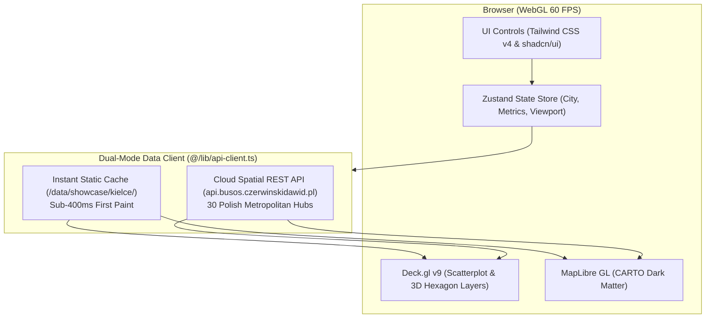

# BusOS Urban Analytics Dashboard

High-performance, GPU-accelerated spatial analytics dashboard for the National Transit Equity & Urban Gravity Platform (**BusOS**). Built with **Next.js 16**, **React 19**, **Deck.gl v9**, and **MapLibre GL**, decoupled from server-side native dependencies to deliver sub-second global responses on **Vercel Edge**.

---

## Live Deployments & Endpoints

*   **Production Dashboard**: [https://busos.czerwinskidawid.pl](https://busos.czerwinskidawid.pl) (Vercel Global Edge CDN)
*   **Spatial Analytical Backend**: [https://api.busos.czerwinskidawid.pl](https://api.busos.czerwinskidawid.pl) (Oracle Cloud Infrastructure Ampere A1 ARM64)
*   **Interactive API Documentation (Swagger)**: [https://api.busos.czerwinskidawid.pl/docs](https://api.busos.czerwinskidawid.pl/docs)
*   **Backend Health Telemetry**: [https://api.busos.czerwinskidawid.pl/health](https://api.busos.czerwinskidawid.pl/health)

---

## Architecture Overview

The dashboard functions as a pure presentation and GPU compute layer, communicating with the backend spatial engine via a decoupled REST API and an instant-paint static showcase cache:



### Core Features
1.  **Dual-Mode Network Client (`@/lib/api-client.ts`)**:
    *   **Flagship Showcase Cache**: Instant static payload for Kielce (`/data/showcase/kielce/`) guarantees immediate 3D rendering (<400ms) for recruiters on cold starts.
    *   **Dynamic Multi-City API**: Streams live Stop DNA, population grids, and notary transactions for all 30 audited Polish metropolitan hubs directly from the high-throughput Python C-GEOS / DuckDB backend.
    *   **Live Health Telemetry**: Monitors backend availability in real-time, displaying engine latency and Swagger documentation links directly in the navigation sidebar.
2.  **Hardware-Accelerated WebGL Rendering**:
    *   **Deck.gl v9**: Instanced GPU rendering of transit stops colour-coded by econometric grade (A+ through F) alongside 3D spatial column aggregations of property transaction values.
    *   **MapLibre GL**: Smooth vector basemaps using CARTO Dark Matter styles.
3.  **Turbopack & React 19 Native**:
    *   Completely decoupled from native C++ bindings (`better-sqlite3`, `duckdb-async`, `wkx`), enabling 100% pure JavaScript/WebAssembly client builds with Next.js Turbopack (~2.3s production build).

---

## Technical Stack

| Category | Technology |
|---|---|
| **Framework** | Next.js 16.2.1 (App Router) with React 19.2 |
| **Bundler & Build** | Turbopack Native Engine |
| **WebGL & Spatial** | `@deck.gl/core`, `@deck.gl/layers`, `@deck.gl/aggregation-layers` (v9.2), `maplibre-gl` (v5.2) |
| **State Management** | Zustand 5.0 |
| **Styling & UI** | Tailwind CSS v4, Lucide React, shadcn/ui, Radix UI |
| **Edge Hosting** | Vercel Global Edge Anycast Network |

---

## Local Development

### Prerequisites
*   Node.js 20+
*   npm or pnpm

### Getting Started

1.  **Install dependencies**:
    ```bash
    npm install
    ```

2.  **Configure environment variables**:
    Create a `.env.local` file (optional, defaults to production API):
    ```env
    NEXT_PUBLIC_API_URL=https://api.busos.czerwinskidawid.pl
    ```

3.  **Run development server with Turbopack**:
    ```bash
    npm run dev
    ```
    Open [http://localhost:3000](http://localhost:3000) to view the application.

4.  **Type check & production build**:
    ```bash
    npx tsc --noEmit
    npm run build
    ```

---

## Deployment on Vercel

The dashboard is configured for zero-configuration continuous deployment on Vercel:
*   **Framework Preset**: Next.js
*   **Root Directory**: `urban-dashboard`
*   **Build Command**: `npm run build`
*   **Output Directory**: `.next`
*   **Custom Domain**: `busos.czerwinskidawid.pl` (CNAME configured via Cloudflare DNS-Only mode)
