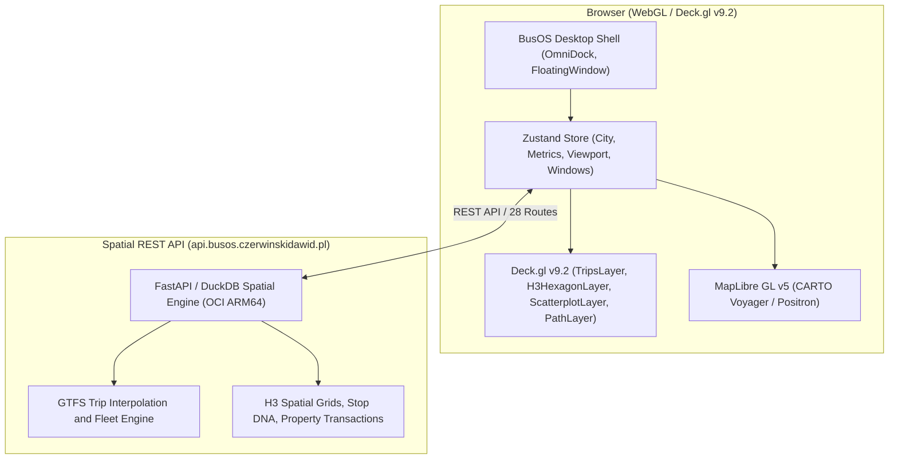

# BusOS Urban Analytics Dashboard

GPU-accelerated spatial analytics dashboard for the National Transit Equity and Urban Gravity Platform (BusOS). Built with Next.js 16, React 19, Deck.gl v9.2, and MapLibre GL v5, decoupled from server-side native dependencies to deliver sub-second responses on Vercel Edge.

---

## Deployments and Endpoints

*   **Production Dashboard**: [https://busos.czerwinskidawid.pl](https://busos.czerwinskidawid.pl) (Vercel Global Edge CDN)
*   **Spatial Analytical Backend**: [https://api.busos.czerwinskidawid.pl](https://api.busos.czerwinskidawid.pl) (Oracle Cloud Infrastructure Ampere A1 ARM64)
*   **Interactive API Documentation (Swagger)**: [https://api.busos.czerwinskidawid.pl/docs](https://api.busos.czerwinskidawid.pl/docs)
*   **Backend Health Telemetry**: [https://api.busos.czerwinskidawid.pl/health](https://api.busos.czerwinskidawid.pl/health)

---

## Architecture Overview

The dashboard operates as an interactive presentation and GPU compute layer, communicating with the backend spatial engine via a decoupled REST API across 30 Polish metropolitan areas:



### Core Capabilities

1.  **BusOS Desktop Shell & Dynamic Windowing**:
    *   **Window Management**: Non-modal draggable, minimizable, and maximizable windows (`FloatingWindow`) for parallel analysis.
    *   **OmniDock**: Central desktop dock managing module states, fleet simulation toggles, analytical layers, and clean map mode.
    *   **Mobile Bottom Sheet**: Adaptive ergonomic bottom sheet for touch devices with snap points (`peek`, `half`, `full`).
2.  **Hardware-Accelerated WebGL Rendering**:
    *   **TripsLayer**: Real-time animated bus fleet movement interpolated from GTFS schedule geometry across 30 cities.
    *   **H3HexagonLayer**: Dynamic spatial binning (resolution 8) visualizing population coverage, POI density, and market values.
    *   **ScatterplotLayer & PathLayer**: Stop markers classified by econometric grade (A+ through F) and route alignments.
3.  **Decoupled API Integration**:
    *   Direct data fetching against 28 REST endpoints on the OCI spatial engine (`/api/v1/stops`, `/api/v1/hubs`, `/api/v1/routes`, `/api/v1/simulation`, `/api/v1/stats`).
    *   Backend availability telemetry and latency monitoring built into the navigation shell.
4.  **End-to-End Test Suite**:
    *   12 Playwright suites covering windowing ergonomics, fleet simulation controls, layer toggling, responsive layouts, and data grids.

---

## Technical Stack

| Layer | Technology |
|---|---|
| **Framework** | Next.js 16.2.1 (App Router) with React 19.2 |
| **Bundler** | Turbopack Native Engine |
| **WebGL & Spatial** | `@deck.gl/core`, `@deck.gl/layers`, `@deck.gl/geo-layers`, `deck.gl` (v9.2), `maplibre-gl` (v5.2), `h3-js` |
| **State Management** | Zustand 5.0 |
| **Styling & UI** | Tailwind CSS v4, Lucide React, BlueprintJS Table2, Radix UI |
| **Testing** | Playwright (12 E2E suites) |
| **Edge Hosting** | Vercel Global Edge Network |

---

## Local Development

### Prerequisites
*   Node.js 20+
*   npm or pnpm

### Getting Started

1.  **Install dependencies**:
    ```bash
    npm install
    ```

2.  **Configure environment variables**:
    Create `.env.local` (defaults to production API if omitted):
    ```env
    NEXT_PUBLIC_API_URL=https://api.busos.czerwinskidawid.pl
    ```

3.  **Run development server with Turbopack**:
    ```bash
    npm run dev
    ```
    Open [http://localhost:3000](http://localhost:3000) to view the application.

4.  **Type check & production build**:
    ```bash
    npx tsc --noEmit
    npm run build
    ```

5.  **Run E2E tests**:
    ```bash
    npx playwright test
    ```

---

## Deployment on Vercel

The dashboard is configured for continuous deployment on Vercel:
*   **Framework Preset**: Next.js
*   **Root Directory**: `urban-dashboard`
*   **Build Command**: `npm run build`
*   **Output Directory**: `.next`
*   **Custom Domain**: `busos.czerwinskidawid.pl` (Cloudflare DNS)
